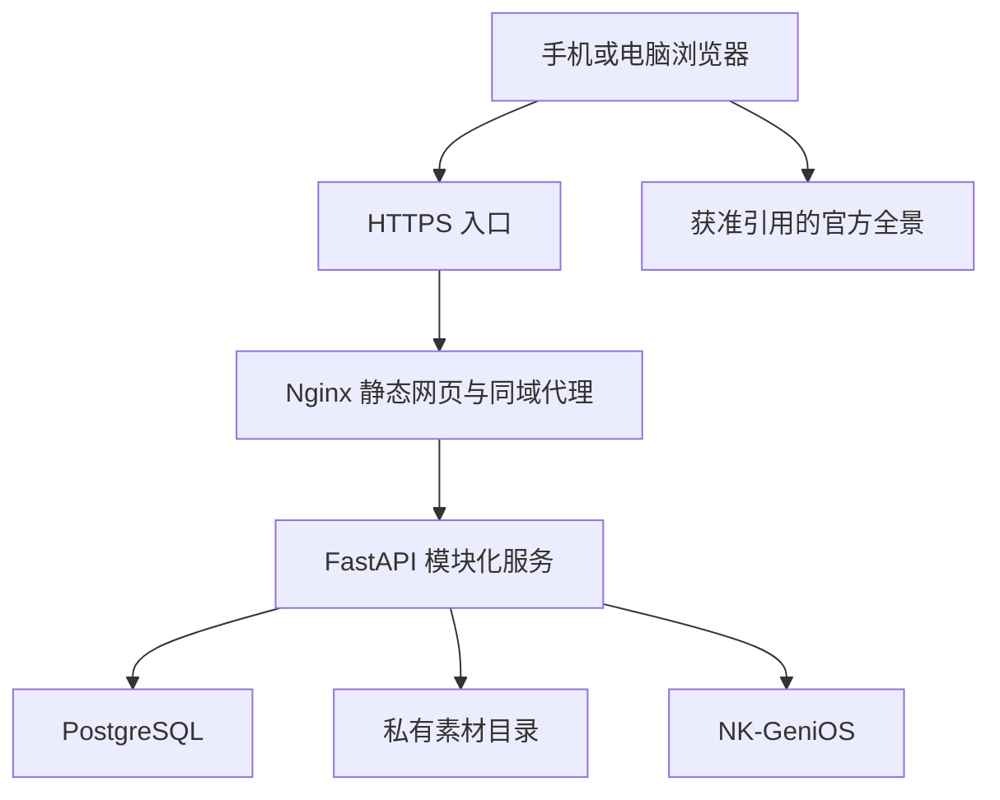

# 技术栈与系统架构

## 1. 固定选型

| 层 | 选型 | 用途与约束 |
| --- | --- | --- |
| 运行时 | Node.js 24 LTS / Python 3.12 | 本地、CI、容器使用同一主/次版本；不在服务器直接运行 Vite 开发服务 |
| 前端 | React 19 / TypeScript 5.9 / Vite 8 | SPA；手机优先；TypeScript 5.9 与类型生成器兼容；以 npm lockfile 锁定完整依赖 |
| 样式 | 原生 CSS + CSS variables | 基础站无需 UI 框架；地图、面板、对话共享设计变量 |
| 地图 | Leaflet 1.9.4，CRS.Simple | 业务坐标是原图像素；集中适配 [x,y] 与 Leaflet [y,x] |
| 前端状态 | React state/context | 当前点位、模式、楼层和导览进度统一维护；规模需要时再经 ADR 增加状态库 |
| API | FastAPI / Pydantic 2 / Uvicorn | HTTP + 后续 SSE；显式输入输出模型、统一异常 |
| 数据访问 | SQLAlchemy 2 / psycopg 3 / Alembic | 同步数据库访问用于常规短请求；长模型请求不占用数据库事务 |
| 数据库 | PostgreSQL 17 | 单实例起步、私网端口；SQLite 仅本地和快速测试 |
| 算路 | NetworkX 3 | 只对经过审核的图计算；模型不生成路径几何 |
| 智能体 | NK-GeniOS HTTP 适配器 | 不假设与商业 Coze API 相同；真实路径/鉴权/流式协议待文档核验 |
| HTTP 客户端 | httpx | 超时、连接限制、错误转换；禁止把任意用户 URL 直接交给后端抓取 |
| 部署 | Docker Compose v2 + Nginx | 模块化单体、同源代理、持久卷、数据库迁移先于服务启动 |
| 验证 | pytest / Ruff / tsc / Vite build / GitHub Actions | 测试关键数据过滤、错误、生产配置、契约和数据库迁移 |

Python 精确解析版本写入 `apps/api/uv.lock`；JavaScript 精确解析版本写入 `apps/web/package-lock.json`。禁止只写“最新版本”。基础镜像按稳定分支选用，正式试点发布应额外记录镜像 digest；基础镜像标签本身不保证按字节可复现。

暂不引入 Redis、Celery、Kubernetes、微服务、独立向量库、图数据库、PostGIS或额外智能体框架。知识检索优先使用 NK-GeniOS。新增基础设施必须说明现有技术无法解决的具体问题。

## 2. 拓扑

公开 VR 在外部站点打开时，本项目不控制该站点权限或采集其内部操作。后端私有素材目录绝不挂到 Nginx 公共静态根目录。

## 3. 仓库目录

| 路径 | 归属 |
| --- | --- |
| apps/web/src/app | 页面组合、全局上下文、能力开关 |
| apps/web/src/features | campus / map / points / routes / vr / floors / chat / tours / admin 独立功能目录 |
| apps/web/src/shared/api | HTTP 客户端、生成类型；禁止每个组件拼接地址 |
| apps/api/app/core | 配置、错误、日志等基础设施 |
| apps/api/app/contracts.py | 对外 DTO，不直接暴露 ORM |
| apps/api/app/models.py | 已实现的数据库模型 |
| apps/api/app/api.py | M00 已实现路由；后续按模块拆分 |
| apps/api/app/integrations | 外部平台适配层 |
| apps/api/migrations | 版本化数据库迁移 |
| contracts | 完整 OpenAPI 和动作示例 |
| docs | 中文技术规范与运营交付说明 |
| deploy | Nginx、容器构建和代理示例 |
| scripts | 契约导出、冒烟、部署、备份 |

## 4. 模块边界

路由层只做输入/身份处理与 DTO 转换；业务服务做权限、版本、状态机；repository 做数据库访问；integration 做第三方协议适配。

地图模块可以读取点位与路线 DTO，不能直接访问聊天组件内部状态。聊天通过 `ActionDispatcher` 提出 UI 动作，地图、VR和楼层通过统一资源 ID 加载数据。前端每次切换点位增加 context revision，旧请求返回不得覆盖新的选择。

后端只通过 DTO/服务访问其他模块，不跨模块修改数据表。跨资源发布须在单事务中记录 publication version，并异步同步知识库；同步失败不得悄悄展示旧口径。

## 5. 同源和网络

- 浏览器调用相对地址 `/api/v1/...`；生产不把 API 域名或密钥放在 VITE 环境变量。
- Nginx 将 `/api/`、`/health/`、`/openapi.json`、`/docs`、`/redoc` 转到后端；生产默认关闭交互文档。
- 开发 Vite 使用代理，不依赖生产 CORS 放开。
- 数据库不映射宿主机公网端口。API 容器只在 Compose 内网开放 8000。
- 首发 Nginx 绑定宿主机 loopback:8080，外层现有 HTTPS 代理转入；避免覆盖服务器现有站点。
- NK-GeniOS 连接仅由后端发起，保存密钥于服务器环境，不写 Git 或浏览器存储。

## 6. 能力开关

`system/status` 返回可用能力。M00 中 map/routing/vr/floors/chat/tours/admin 全部 false。前端不可通过随意改前端开关获得后端能力。

某模块只有在代码完成、数据可用、必要的权限控制就绪及验收通过后才开启。第三方不可用须体现降级，而不是返回固定成功文本。聊天关闭不影响资料浏览。

## 7. 参考与核验范围

- [Vite 官方指南](https://vite.dev/guide/)：构建与 Node 运行要求。
- [Leaflet 非地理地图](https://leafletjs.com/examples/crs-simple/crs-simple.html)：CRS.Simple、图片与坐标。
- [FastAPI](https://fastapi.tiangolo.com/)：接口模型、文档与依赖。
- [SQLAlchemy 2 ORM](https://docs.sqlalchemy.org/en/20/orm/quickstart.html)：数据库模型与 Session。
- [PostgreSQL 版本策略](https://www.postgresql.org/support/versioning/)：主版本生命周期。
- [Docker Compose 启动依赖](https://docs.docker.com/compose/how-tos/startup-order/)：数据库健康、迁移完成后的启动顺序。

以上文档支持架构选型，不证明本项目已完成服务器或 NK-GeniOS 联调。
