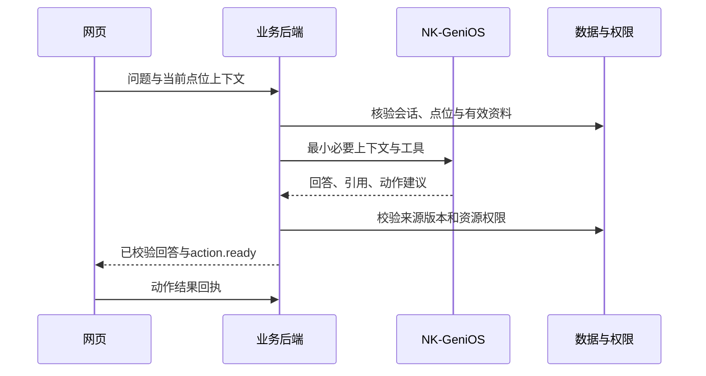

# NK-GeniOS、会话与界面动作协议

## 1. 已知和未知

用户提供的发布页显示 API、Web服务、WebSDK运行中，MCP已停用，因此首版选择API集成。样例公开聊天页为 `https://coze.nankai.edu.cn/product/llm/chat/dapbhi54shh989l2d7f0`，它不是后端调用接口。

尚未核实：调用URL、鉴权header、bot/workflow标识、请求body、返回字段、流式格式、工具调用、检索来源元数据、限流、取消及平台会话行为。不得直接套用商业Coze或OpenAI协议；不得以URL slug猜bot_id。

本次提交仅保留禁用的适配器接口。没有真实接口样例之前，chat能力=false，浏览器不会发出假AI请求。

## 2. 平台接入检查表

由管理页/官方文档取得不含密钥的curl示例，确认以下条目并填写接入记录：

| 项目 | 验证方法 | 通过条件 |
| --- | --- | --- |
| 最小对话 | 后端发送一条非敏感问候 | 收到真实平台响应及请求标识 |
| 多轮会话 | 第二轮引用第一轮信息 | 会话隔离，无其他访客上下文 |
| 检索来源 | 查询一条上传的审核资料 | 返回可映射source_id/revision，或通过我方检索服务补齐 |
| 结构化输出/工具 | 请求focus_point | 能稳定解析；错误输入不产生执行动作 |
| 超时/拒绝 | 无效请求、可控超时 | 转换为统一错误；不泄露token |
| 并发/流式 | 两个会话独立请求 | 不串话，不因断线重复执行 |
| 数据边界 | 确认平台可接收的数据等级 | 首版只上传获准公开资料，受限资料不混入公用知识库 |

原始响应样例去密钥、去个人信息后存 fixtures；密钥仅服务器环境配置。平台来源能力不足时，准确性目标不能靠模型自行填source_ids补救。

## 3. 适配层的内部输入输出

`AgentInput`：turn_id、message、经服务端核验的ViewContext、允许使用的点位ID集合、审核检索片段及source版本、工具定义。访问者role从会话读取，不能接受前端body直接指定。

`AgentOutput`：answer_text、引用source_ids、提出的动作列表。此时动作尚不可信。模型输出不含可执行JS、HTML、SQL、storage_key或任意URL。

平台能调用工具时，工具实现调用我方service；只能输出结构化JSON时，适配器解析为同一内部对象，再做等价校验。两条路径业务语义相同。不是从自然语言中正则提取一串URL就执行。

## 4. 动作白名单

| type | resource_id 指向 | 校验 | 前端处理 |
| --- | --- | --- | --- |
| focus_point | point | 存在、可见、几何版本一致 | 选中建筑、平移地图、打开面板 |
| show_route | route_result | 当前会话所有、未过期、图版本有效 | 按segment绘制，不跨层连线 |
| open_vr | media_asset(kind=panorama) | 资源权限、官方URL白名单、有效发布 | 提供用户可点入口；允许时嵌入 |
| show_floor | floor | 当前可见、关联建筑合法 | 切换建筑/楼层、加载相应地图 |
| play_narration | narration | 审核版本、有效来源、音频可用 | 用户手势后播放；文字稿始终可见 |
| show_tour | tour_plan | 会话所有、版本和点位有效 | 展示行程序列与当前进度 |

公共AgentAction字段：action_id(UUID)、type、resource_id(UUID)、resource_revision、context_revision、requires_user_gesture。

**不允许** delete_content、publish_content、change_role、fetch_arbitrary_url、run_code等动作。身份管理、内容审核与发布不会因用户对话而执行。

## 5. 端到端顺序



平台请求不能长期占住数据库事务。先读取必要快照、释放连接，模型完成后在短事务里重新检查关键有效性。

## 6. SSE与状态机

客户端先POST创建turn得到202和events_url，再用同源EventSource读取。鉴权来自HttpOnly cookie，不把API key附在query参数。

状态：queued → running → completed/failed/cancelled。三个终态互斥。一个会话默认同时只运行一个turn；第二个请求409 INVALID_STATE。不同访客会话可并发。

事件格式：

```text
id: 3
event: action.ready
data: {"turn_id":"00000000-0000-4000-8000-000000000010","seq":3,"type":"action.ready","action":{"action_id":"00000000-0000-4000-8000-000000000011","type":"focus_point","resource_id":"00000000-0000-4000-8000-000000000001","resource_revision":1,"context_revision":2,"requires_user_gesture":false}}

```

所有示例ID是占位说明。seq单调递增且在DB按turn唯一。客户端按(turn_id,seq)去重，动作另按action_id去重。断线重连用Last-Event-ID；15秒心跳注释；反向代理禁用buffer。事件留存覆盖访客会话有效期，超过保留期返回410并提供读取终态的路径。

事件：turn.started、answer.delta、source.added、action.ready、turn.completed、turn.failed、turn.cancelled。ChatEvent模型规定data结构。SSE建连前错误用统一HTTP错误；连接后错误发turn.failed，不再改HTTP状态。

官方政策、校史事实和权限相关回答先核验引用及有效性再发给前端。不可为了“打字效果”先输出未经校验的上游内容。允许先发送不含事实的等待状态；answer.delta可在审核后分块输出。

## 7. 前端上下文与用户控制

前端维护当前campus/point/map/floor/tour/mode和递增context_revision。用户切换点位或导览模式时revision+1；较旧turn返回的动作若revision不匹配，标为skipped/stale_context，不覆盖用户新选择。

弹新窗口、播放音频等受浏览器手势限制，requires_user_gesture=true；界面给明确按钮，由点击触发。模型不能强制自动播放。

只有前端成功应用动作才回传applied；加载失败failed/resource_unavailable；用户取消skipped/user_declined。回执只作诊断/统计，不据此提升权限或伪造真实到达。

## 8. 超时、重试和降级

初始预算：连接5秒，首个上游响应30秒，总请求90秒。属于初始工程参数，联调后按实际平台调整并留记录。客户端可取消；即使平台无法停止计算，也停止本系统继续推送，并防止迟到动作生效。

用户提交的turn使用client_message_id与Idempotency-Key，网络重试不创建第二次业务执行。上游是否支持幂等要验证，不盲目重试可能已接受的生成任务。

平台失败：返回AGENT_UNAVAILABLE/UPSTREAM_TIMEOUT，保持地图和静态资料可用；不把预设句子标成真实AI回答。基础UI可展示官方资料按钮，但不得静默替换为另一供应商。

## 9. 事实、权限与提示注入

检索文本仅是资料，不是系统指令；工具权限不可被资料中的“忽略前文”等语句改变。来源id须对应实际返回片段，模型不能凭空添加。发布/到期/公开范围由业务系统复核。

政策类回答尽可能使用审核模板和明确有效期；资料不足时说明不确定并给经核实官方渠道。普通批评或质疑不应简单当作不当提问拦截；重点防止隐私索取、越权访问、恶意指令和无依据事实输出。
