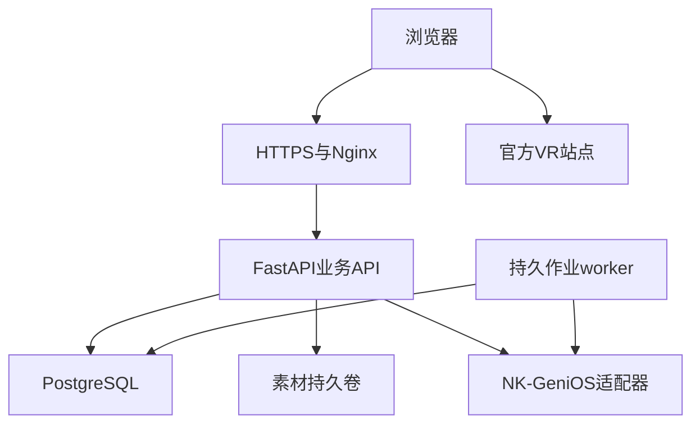

# 架构、数据治理与可靠性详细设计

此文保留现有技术基线；新增表、队列和作业均为待实现设计。现有实体以models.py/Alembic为准，不能按本文在生产直接建表。

## 1. 技术栈与选择理由

| 层 | 固定方案 | 为什么适合现在 | 扩展门槛 |
| --- | --- | --- | --- |
| Web | React19、TS5.9、Vite8、原生CSS | 现有工程可增量，减少框架迁移成本 | 复杂状态有性能/维护证据后才引入状态库 |
| 地图 | Leaflet1.9.4 CRS.Simple | 已有精确规划图像素体系与瓦片 | 地理坐标经标定后才考虑地理投影 |
| 服务 | Python3.12、FastAPI、Pydantic2、Uvicorn | typed契约和模块化服务清晰 | 按瓶颈拆worker，不先拆微服务 |
| 数据 | PostgreSQL17、SQLAlchemy2、psycopg3、Alembic | 事务、并发、审核、审计持久化 | 生产禁止SQLite替代 |
| 智能体 | NK-GeniOS后端HTTP适配器，httpx | 复用学校能力，密钥与会话集中控制 | 真实API核验后再确定协议细节 |
| 路网 | NetworkX3 | 审核小规模图足够 | 有真实图及性能瓶颈才改专用服务 |
| 部署 | Docker Compose v2、Nginx、同源HTTPS | 与现有4核/约8GB服务器匹配 | 负载量和运行指标决定扩容 |
| 质量 | pytest、Ruff、Node tests、tsc、GitHub Actions | 已有可复用CI | UI任务回归在合规浏览器/CI加入 |

Node主版本24；精确包版本以package-lock.json/uv.lock为准。系统Python3.8不运行API；部署使用Python3.12容器。介绍导入脚本单独维持标准库3.8兼容。后续依赖更新必须单独PR、锁定版本并回归，不在冲刺中无理由全量升级。

## 2. 部署拓扑和责任边界

worker是计划新增同代码库不同进程，处理索引同步、对话turn、资源巡检；不必先引入Redis/Celery。当前服务尚无worker，不能把图示当部署事实。public API/worker不会持有root SSH凭据。VR外站不经任意URL代理。

## 3. 模块边界及调用方向

| 模块 | 数据所有权 | 对外业务服务 | 不允许 |
| --- | --- | --- | --- |
| maps/points | 当前点位、几何、地图版本 | 读取公开上下文/地图 | 聊天直接改几何 |
| floors/resources | 楼层标注图、VR入口 | 可见资源解析、访问 | 前端传storage_key取任意文件 |
| sources/knowledge（计划） | 来源版本、片段、索引映射 | 发布资料检索与事实依据 | 模型决定公开级别 |
| chat（计划） | 会话、turn、事件、动作 | 接收问题、取消、事件订阅 | 请求期间长占数据库事务 |
| tours（计划） | 模板、实例、访问进度 | 编排/调整/回顾 | 无路网虚构walking路线 |
| routes（计划） | 图、边、入口、路线结果 | 确定性算路 | AI生成路径像素坐标 |
| inquiries（计划） | 脱敏问题、解决状态 | 归类、认领、复测 | 公开原始私人聊天 |
| admin | 员工身份、scope、草稿、审计 | 编辑、审核、发布 | UI隐藏代替后端授权 |

router解析认证/输入→service检查业务→repository参数化查询；integration只知道外部协议。跨模块通过service/DTO，不互相随意写私有表。API不返回SQLAlchemy对象或整行内部配置。

## 4. 当前数据不变量

1. Point ID稳定，名称不是主键；改名/挪点不新建同义建筑。
2. campus_id隔离校区；map_id+revision定义图片坐标空间；x向右/y向下、单位原图像素。
3. 图块、几何、路径必须同map revision；不一致停止绘制并重取。
4. 草稿和公开快照分开；审核发布才替换正式版本；下架保留历史。
5. 原图SHA256、width/height/size/mime记录；资源替换产生新版本，不能覆盖旧字节后冒用旧hash。
6. 编辑提交携带expected_revision；后台修正为现行事实，历史seed/素材包不得反向覆盖。
7. 一层可多分区，section在floor revision内唯一；当前只公开labeled。
8. 对外资料仅active校园+published+允许公开，关联建筑下架不能泄漏其楼层。
9. 生产当前迁移head=0005_resource_editor；新增迁移用新的连续revision和明确downgrade边界。

## 5. 新增数据结构建议

以下字段为目标设计；表名可随最终迁移明确，但语义不可丢。共同字段id UUID、created_at/updated_at UTC、revision正整数；删除优先retired_at/status，不硬删正在被引用的资料。

### 5.1 来源与讲解

| 实体 | 关键字段/类型 | 约束与索引 |
| --- | --- | --- |
| source_document | campus_id, title varchar200, kind(enum official_page/file/policy/map), canonical_url nullable, owner, visibility, status | 校区+状态索引；URL独立验证，非任意抓取任务 |
| source_version | source_id, version int, body text, sha256 char64, checked_at, valid_from/to, reviewer_id, evidence_scope text | unique(source_id,version)；valid_to>valid_from；批准版本不可原地改正文 |
| source_chunk | source_version_id, ordinal int, body, section_title, offsets JSON | unique(version,ordinal)；offset指向实际正文，回答必须能定位原片段 |
| point_content | point_id, locale, mode(short/standard/deep), text, source_refs JSON, revision, status | 首版不要把所有深度内容塞入summary2000字；每条引用含source/version/chunk |
| content_dependency | owner_type/id/revision, source_version_id | 支持来源撤回反查受影响讲解/主题/音频 |
| knowledge_binding | source_version_id, provider, external_document_id, index_state, indexed_at, last_error_code | 平台ID不是公开ID；重复同步幂等；不存密钥 |

来源有效和“事实被来源支持”是两项检查。checked_at只能说明核查时间，不自动延长政策有效期。地图事实可说明显示名称位置，不能支持建成年代、具体用途、开放时间。

### 5.2 独立场景与关联

| 实体 | 关键字段 | 约束 |
| --- | --- | --- |
| panorama_scene | campus_id, title, provider, canonical_url, source_url, description, cover_asset_id?, status, reviewed_at | 同provider+经确认的scene_key唯一；不能随意去掉URL中的场景参数 |
| scene_point_link | scene_id, point_id, floor_id?, section?, relation(primary/visible/related), sort_order | unique(scene,point,floor,section)采用明确null语义；校区一致 |
| media_asset | kind, byte_size, mime, hash, storage_key, visibility, source_version_id?, status | storage_key不进入公开DTO；访问经service |

现有PanoramaRecord按点位持有URL。迁移先建scene/link并复制引用，核对数量与URL，保留原记录和公共接口读兼容层；完成后再切写入。禁止一次删旧表导致原审核和链接ID失效。

### 5.3 会话、turn与事件

| 实体 | 字段 | 不变量 |
| --- | --- | --- |
| visitor_session | token_hash, expires_at, revoked_at, csrf_hash, pseudonymous_id | cookie存随机token，DB仅hash；匿名不是无鉴权 |
| chat_session | visitor_session_id, provider_session_id?, expires_at | 访问者只能读自己的会话 |
| chat_turn | session_id, client_message_id, input_digest, question_redacted, context JSON, state, lease_owner/until, deadline_at, error_code | unique(session,client_message_id)；每session最多一个queued/running |
| chat_event | turn_id, seq bigint, type, payload JSON, created_at | unique(turn,seq)，服务端排序；payload大小上限 |
| validated_action | turn_id, action_id, type, resource_id/revision, context_revision, validation_state | unique(action_id)；执行前重新核对资源 |
| action_receipt | action_id, status, reason, created_at | terminal回执幂等；不能通过回执提高权限 |
| idempotency_record | principal_id, route_key, key_hash, request_digest, response_ref, expires_at | 同key同body回同结果，不同body409 |

用户原始问题若需短期保留必须有用途、访问权限和期限；长期统计使用脱敏摘要。平台会话ID/响应追踪ID只在服务端，日志不写完整平台请求体。

### 5.4 主题与路网

| 实体 | 字段 | 约束 |
| --- | --- | --- |
| tour_template_version | template_id, theme, locale, goals[], audience, stop_specs[], duration_reading_estimate, source_refs, status | 审核快照不可原地改；历史计划引用固定版本 |
| tour_plan | session_id, template_version_id, mode, state, revision, budget_minutes, expires_at | owner检查；virtual.route_id=null |
| tour_stop_progress | plan_id, stop_id, order, state, visited_at?, skipped_reason? | unique(plan,stop)；完成不由模型凭空推断 |
| learning_response | plan_id, question_id/version, response_redacted, feedback_ref | 提供删除/清空路径；不作为学生成绩档案 |
| route_graph_version | campus_id, revision, status, calibrated, approved_at | 仅approved可算路；地图变更须检查相关边 |
| route_node/edge | map_id/revision, x/y, endpoint_type, accessibility, timetable, geometry, measured_length_m? | 外键、像素范围、连通性、边状态检查 |

室外/楼层不同图用明确连接节点，不能把两张图的像素直接相连。图和来源撤回触发新计划禁止引用，旧计划读取时也要重新检查可见性。

## 6. 发布与索引一致性（必须实现后才能宣称AI口径实时更新）

发布事务同时写：正式内容版本、审核审计、outbox事件。外部知识平台不参与数据库事务。worker领取事件→幂等同步→记录外部ID/源版本→可查询索引状态；失败重试有上限和人工重放入口。

outbox字段：id/event_type/resource_type/id/revision/dedupe_key/state/attempts/not_before/lease_until/last_error_code；unique(dedupe_key)。领取可用FOR UPDATE SKIP LOCKED短事务；网络请求在事务外；完成时核对lease和版本，旧事件不得覆盖新版本。

平台检索结果返回时必须映射源版本，已下架或过期来源拒绝使用。索引滞后期间，关键政策直接读正式数据库模板；其他资料可以明确暂不可回答。不能只靠“重试上传知识库”保证不回答旧口径。

撤回优先级高于补索引：本地denylist立即生效，后台异步撤回平台副本。公开HTTP资源每次仍查现行权限；不能依靠CDN旧缓存撤销受限内容。

## 7. 并发、作业与恢复

初期可以单API进程+单worker，数据库保存所有任务。不要以FastAPI BackgroundTasks或进程内字典充当可靠聊天队列：重启会丢失任务，多worker会串状态。queued以DB事务创建，worker租约30秒、10秒续租为初始参数；上游90秒总预算，超期转failed。参数是拟定起点，联调后调整。

worker失联后：有平台任务查询/幂等支持则安全恢复；无此能力时标明不确定失败，禁止自动重复收费生成。SSE从DB事件重放，不依赖同一worker内存。终态compare-and-swap，completed/failed/cancelled互斥。取消先落库，再尝试平台取消；迟到响应不得复活取消任务。

后台编辑、资源审核、路线计算使用短事务。慢上传先写临时隔离区，校验通过后登记；失败清理暂存文件，不能提前公开半文件。测试双并发写入只允许一个成功，另一返回409。

## 8. 缓存与容量设计

| 对象 | 初始方案 | 失效方式 |
| --- | --- | --- |
| 公开目录 | 当前no-store+可见轮询；后续可ETag | published_revision变更；下架立即失效 |
| 校园图块 | 版本URL；当前仍遵守服务端公开检查 | 图下架/版本变化不可命中过期公开缓存 |
| 受限图片 | private/no-store，授权读取 | 每次校验，不用永久公开直链 |
| 问答 | 初期不做共享答案缓存 | 后续key含角色/源版本/问题规范化/策略版本 |
| 静态JS/CSS | hash文件可immutable；HTML短缓存 | 新构建hash |
| 路线结果 | owner+图revision+有效期 | 关闭边/图升级后重算 |

服务器参考配置为用户报告4核/7.8GB/49GB，不当作当前实测。初始建议预留系统/代理约1GB、DB约2GB、API/worker各1GB，其余文件缓存与余量；这是容量预算，不是已设置容器限制。启动后测RSS/连接数/峰值再设置限制。图片/备份/日志累计增长必须设容量告警，不能自动docker volume prune。

## 9. 错误、日志、版本

公共错误沿用error.code/message/details + meta.request_id。request_id由服务端生成；外部异常转统一分类，客户端不看到SQL/路径/密钥。可观测维度：release_sha、module、route_template、status、duration_ms、resource_revision、provider_error_code；不默认记录完整问题和来源正文。

每次发布记录应用SHA、容器digest、迁移head、地图revision、资料发布revision、索引revision、开关状态。APP_VERSION现值不能单独证明改动已部署；同版本标签重复构建尤其要核对SHA。

## 10. 架构决策记录（ADR）

- ADR-001：继续模块化单体；理由是团队/现有资源，不以微服务数量表示成熟度。
- ADR-002：原图像素为唯一校园图坐标，地图不冒充真实GPS测量。
- ADR-003：已发布业务库为事实/权限主源，NK知识索引为可重建副本。
- ADR-004：结构化动作经服务端验证，模型不能直接控制DOM或后台。
- ADR-005：持久化turn/outbox优先于引入新中间件；确有吞吐瓶颈才评估Redis等。
- ADR-006：virtual导览优先独立上线，walking依赖实测路网，解耦里程碑。
- ADR-007：UI按任务复用面板，高清图和后台发布数据保持稳定。

每条ADR有owner/date/status/context/decision/consequences。改变已定选型必须指出失效的假设、迁移成本、兼容方案与回退；不凭流行度重写。

参考：[FastAPI容器部署](https://fastapi.tiangolo.com/deployment/docker/)、[Compose启动依赖](https://docs.docker.com/compose/how-tos/startup-order/)、[Leaflet坐标](https://leafletjs.com/examples/crs-simple/crs-simple.html)。
