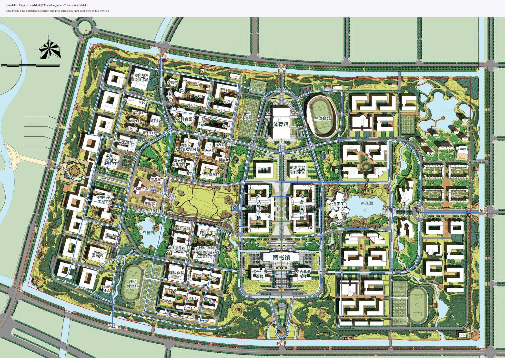

# 路网初稿与精修工作台升级

2026-09-28。用户明确：后台用于在Codex先完成的基础上进行更精确的人工控制，不应把基础工作全部交给团队。本批以该要求替代上一版“从空白逐条画路”的主要使用流程。

## 已经替团队完成的部分

- 按当前线上津南校区第3版公开底图整理 **215段道路、178个节点、52个入口候选，涉及51个地点**。主干路、校园门区、图书馆和教学区、主要学部及部分宿舍已形成一个连通的图上路网。
- 初稿内含弯道形状、道路交点拆分、建筑关联、来源说明。它作为代码资源随API镜像提供，不需要另外上传图片或运行生产种子。
- 已读取并核对线上地图元数据和图块；底图ID、revision、尺寸、SHA256严格绑定。用户此次两份规划图ZIP相同，尺寸一致但文件指纹与线上修订图不同；初稿采用线上修订图坐标，原始ZIP仅辅助观察建筑与道路细节。
- 作者源文件为`scripts/build_road_starter.py`；运行它可确定性重建`apps/api/app/modules/road_seed.json`，不会连接数据库、修改地图或发布内容。
- 这是本次依据具体底图预先整理的草稿，不是“任意换一张图就自动识别全校路网”。真实门禁、单行、台阶、封闭情况无法仅凭规划图证明，因此保留明确候选与核验状态。

初稿不是全校完整覆盖。未命名建筑不新增关联；有歧义的西南门关联未强行指定；湖泊、绿地不以中心点当建筑入口。入口候选按可辨认的门区、建筑边缘或广场连接整理，精确门口和当前开放情况仍需修正。道路名中“北侧”“片区”等是编辑描述，不是官方命名声明。

## 升级部署

从本批最后完整提交、且其CI通过的`feat/admin-console`升级。继续使用现有Compose项目、数据库和素材卷；先备份再按原`bash scripts/deploy.sh`同时重建API/web。**本批不增加迁移，数据库仍是0006_navigation**；如果还未部署上一批，先按[40](40-native-agent-navigation.md)完成0006和原生问答配置。

禁止重跑历史校园地图导入或旧种子覆盖线上坐标。原有路网草稿/公开版本保留；新版增加的曲线、候选字段存在原JSON列内。旧前端不能正确编辑曲线控制点，不能只更新API或直接回退到旧编辑器修改曲线数据。

服务器更新、浏览器操作、现场确认各自验收。GitHub CI不代替手机触控、学校模型和真实路线验收。

## 从初稿开始

1. 后台 → **道路与导航**。空白路网显示初稿卡片和道路/入口数量。
2. 点击 **载入已整理路网初稿**：全部内容进入当前编辑区，尚未自动写库或发布，可以撤销。
3. 保存草稿，再选起终点 **试算已保存草稿**。草稿允许试算未核验道路与候选入口，以便尽早发现问题；公众接口不会使用它们。
4. 用“只看待核验/待确认”、名称搜索和路网检查处理重点区域。定位按钮会移动视图并选中对象。
5. 确认实际入口后，填写依据并勾选入口确认；图上拖动入口会重新标为候选。
6. 对相同资料/实地核验覆盖的道路，可通过“选择当前筛选道路”批量填写依据并确认；批量封闭/恢复也需要原因。
7. 仍采用既有独立审核和revision冲突规则，发布后前台地图导航与AI路线共用同一份路网。

已有路网时不显示“替换初稿”按钮，避免误覆盖人工成果。内置草稿会移除当前已下架/未公开的建筑关联，并关闭相邻入口连接，避免把撤回地点当捷径；底图不匹配时拒绝载入，不自动拉伸坐标。

**可以分区发布**：暂不启用的路段批量关闭；开放路段及与之相连的入口须确认。已关闭区域的未确认入口可以保留在草稿/版本中，但不会用于公开算路。不必为了演示一条路线就声称全校道路都已核验。

## 精修工具

| 工具 | 操作 | 保存结果 |
| --- | --- | --- |
| 折线道路 | 逐点点击；点已有节点或“完成道路”结束 | 一条道路加中间形状点，不把每个转弯强制变成路口 |
| 绘制弧线 | 依次选择起点、控制点、终点；选中后拖控制点 | 二次贝塞尔曲线；前后端同一32段采样几何 |
| 自由描线 | 按住鼠标或单指沿路画，松开完成 | 自动简化为折线形状点；最多100个中间点 |
| 编辑形状点 | 拖实心点改变弯道；拖半透明中点增加点；双击实心点删除 | 保留道路两端拓扑关系 |
| 拆分路口 | 切到该工具并点击道路 | 精确拆成两段、共用一个路口，保留原方向/封闭属性 |
| 吸附连接 | 开启吸附，画到/拖到旧道路或节点 | 12屏幕像素范围内接入节点或拆分旧道路 |
| 弧线/折线转换 | 道路详情中切换 | 曲线转形状点保留采样路径；折线转单弧线需重新调整 |
| 反转起终点 | 道路详情按钮 | 调整单行方向，折线形状点顺序同步反转 |
| 坐标精修 | 输入节点X/Y | 原图像素坐标，不是GPS |
| 撤销/重做 | 按钮，或非输入框内Ctrl/Cmd+Z、Shift+Z | 当前编辑会话保留40步；保存/重载后开始新历史 |
| 导出/导入备份 | 下载JSON，选择原地图备份导入 | 核对底图ID/指纹/版本；导入后重新确认道路与入口 |

自由描线模式暂停地图拖动与双指缩放，可用缩放按钮；单指描线仍待手机实测。超过5000个采样点要求分段，避免长笔画拖慢界面。离开页面会提示未保存内容；未完成道路须先完成或取消，不能把保存当前草稿误认为已保存半条笔画。

拖动节点、修改道路形状或拆分后，会清除相关实测长度和核验状态，不能沿用旧几何的测量值。节点名称、核验文字等不改变几何的编辑不会清除长度。道路方向改变仍需重新核验。不同建筑的入口禁止合并；合并会造成重复道路时要求先整理，避免静默丢失属性。

## 路网检查与批量维护

“检查连通与缺口”读取当前编辑区，不要求先发布、不写数据库：

- 显示连通区域数、已连接地点数、待确认入口、未覆盖地点。
- 定位孤立节点、与主路网不连通的区域、靠近道路但未连接的端点。
- 找出图上相交、拓扑没有共同路口的道路；确认同层可通行后，可“连接为路口”。桥上/桥下、墙两侧不能按视觉交叉直接合并。
- 按待核验道路/入口集中处理，减少逐条查找。
- 复杂图形的几何检查有预算上限，达到上限明确提示“部分检查”；一次最多返回200条问题，不能把截取结果理解成没有其他问题。

“一个连通区域”只表示无向几何连接；单行和封闭造成的具体可达性用草稿试算核对。检查不会识别图上所有建筑、水域、围墙或实际管控，不能代替资料/现场判断。

## 验收与后续顺序

本批新增前端几何回归：曲线采样与拆分、折线形状保留、吸附拆路、交点/重合端点连接、不同建筑入口保护、候选状态恢复、自由线简化、撤销重做。后端覆盖曲线正反向路径、范围/混合形状拒绝、候选入口审核、只读诊断与scope、初稿指纹/公开资源过滤、初稿可复现和图上连通性、复杂诊断上限。

部署后优先验收：载入 → 保存 → 南门到图书馆试算 → 拖弯道 → 拆分并连接 → 撤销/重做 → 批量设置 → 独立审核 → 前台高亮 → 问小开同一路线。原图与点位坐标不得变化。

后续开发顺序：先根据团队试用把首条真实导览链路磨稳，再补未覆盖入口和道路；之后接主题导览/研学任务与参观回顾。语音、全校室内导航、任意地图自动识别与服务器自动发布均不作为本批已完成功能。
