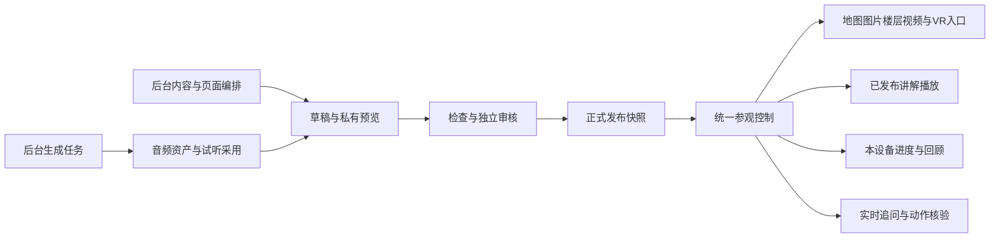

# 南开校园数字文化展馆最终完整开发方案

设计版本：1.6。定稿日期：2026-10-03，Asia/Shanghai。

本文是前台旗舰导览、后台可视化管理、安全上线和零基础交接的统一开发依据，供项目负责人、开发、内容编辑、审核及运维人员共同使用。它替代此前两份设计中的冲突描述；历史部署事实仍以交付记录为准。

成品目标是让游客连续完成“发现主题、进入真实空间、听讲解、看资料、追问、留下参观回顾”，让接手人员通过后台独立维护内容和运营。本文规定最终目标和验收要求，不因文档定稿而视为已经开发、上线或通过验收。当前实现进度、测试结果及未完成项单独记录于[开发实施记录](59-exhibition-implementation.md)；本次方案合并不改变生产内容或运行配置。

## 目录

- [1 总体决策与范围](#1-总体决策与范围)
- [2 当前基础与待完成事项](#2-当前基础与待完成事项)
- [3 成熟产品和开源项目的取舍](#3-成熟产品和开源项目的取舍)
- [4 用户端页面与视觉设计](#4-用户端页面与视觉设计)
- [5 地图楼层和到校参观](#5-地图楼层和到校参观)
- [6 小开与参观互动](#6-小开与参观互动)
- [7 后台工作区与可控制范围](#7-后台工作区与可控制范围)
- [8 内容编排审核与版本管理](#8-内容编排审核与版本管理)
- [9 正式讲解制作与存储](#9-正式讲解制作与存储)
- [10 技术架构和数据模型](#10-技术架构和数据模型)
- [11 接口与参观状态](#11-接口与参观状态)
- [12 安全和运行控制](#12-安全和运行控制)
- [13 备份恢复与配套发布](#13-备份恢复与配套发布)
- [14 开发阶段与交付顺序](#14-开发阶段与交付顺序)
- [15 测试与验收标准](#15-测试与验收标准)
- [16 交接包与后续蓝图](#16-交接包与后续蓝图)

## 1 总体决策与范围

### 1.1 产品定位

建设一座可漫游、可聆听、可追问的校园数字文化展馆。地图帮助用户理解空间，楼层帮助观察细节，图片和视频呈现真实资料，VR 提供进入真实场景的入口，导览把这些资源组织成有顺序、有来源的故事。

后台成为日常内容和运营的控制中心。每一项面向游客的可配置内容与运营功能，必须同时交付后台入口、默认值、预览、权限、版本记录、检查和帮助说明。

### 1.2 已确定的产品选择

| 事项 | 最终决定 |
| --- | --- |
| 优先体验 | 线上沉浸导览优先，同时保留到校参观与自由探索 |
| 首版范围 | 完整旗舰首版，并提供明确的后续蓝图 |
| 路线 | 支持团队规划的六条及后续新增路线；名称、站点、顺序、讲稿和发布由团队管理 |
| 后台方式 | 内容编辑加预置模块编排；日常维护不需要代码、JSON、资源 ID 或服务器操作 |
| 页面控制 | 可开关、排序、选择版式和修改内容；系统维护响应式布局及必要入口 |
| 首页内容 | 后台手动选择主视觉、按钮目标和推荐路线；未配置时用中性默认，不自动抽取首张图片或首条路线 |
| 讲解 | 正式讲解提前生成、试听、审核并保存；个性化追问实时回答 |
| 轻量互动 | 可选观察提示、收藏、本地笔记和实际参观回顾 |
| 形象风格 | 真实校园影像、明亮白色区域、南开紫和已经确认的二维小开 |
| VR | 官方 HTTPS 原网址新标签页打开；室外场景关联真实独立地点，默认隐藏常驻地图名称 |
| 定位导航 | 首版人工选择起点、人工确认到达，沿用已有路网 |
| 公众身份 | 免共享口令；实时问答与实时回答播报受匿名访客会话与额度保护；已发布正式音频走独立公共读取 |
| 安全基线 | OWASP ASVS 5.0.0 适用 L2，形成证据与缺口清单 |
| 备份位置 | 按用户选择留在服务器内，加密并定期恢复演练 |

### 1.3 首版必须完成的闭环

游客能完成选主题、开始参观、地图与媒体切换、暂停追问、回到讲解、继续进度及回顾。编辑能完成配置、选素材、预览、音频制作、提审、处理退回及历史找回。审核人员能看到具体差异、依赖及公众效果，独立决定发布。管理员能判断服务状态、控制批准范围内的运营参数、暂停异常功能并查到处理流程。

精确时间轴、GPS 自动到达、全校室内算路、跨域 VR 控制、角色重制、自由代码搭站和完整离线包不进入首版。后续能力须满足各自的数据和维护条件，不挤占首版完整性与安全验收。

### 1.4 两份方案合并后的统一约定

本方案将“后台编排、前台呈现”的产品与技术要求，以及“安全上线”的身份、权限、费用和运维要求作为同一交付范围。两部分共用内容模型、公开读取链路、测试矩阵和发布门槛。

| 原方案关注点 | 统一后的开发要求 | 验收依据 |
| --- | --- | --- |
| 六条规划路线与新路线 | 系统不预设具体名称、顺序或讲稿；团队从后台持续维护 | 任意合法路线可配置、预览、审核和公开 |
| 可详细控制且新手可用 | 每项公众配置都有可理解的字段、默认值、素材选择、影响说明和恢复流程 | 第 7 章控制矩阵及第 15.4 节新手实际任务 |
| 前台与预览一致 | 同一呈现组件读取正式快照或受认证保护的员工草稿 | 草稿权限测试、电脑手机预览与公众效果比对 |
| 保存检查与发布检查 | 草稿允许暂缺业务内容；结构、大小、权限始终检查；提审及发布要求完整有效依赖 | 保存不误发布，失效引用不进入公众读取 |
| 正式讲解与实时问答 | 讲解预生成、试听采用、审核发布；追问实时调用，两者分别控制 | 关闭问答或合成仍能播放有效正式音频；普通预览零收费 |
| 全部审核集中 | 地点、资源、路线、页面配置和运行策略统一进入审核中心，保留各自权限 | 贡献者不能自审；所有旧写入口不能绕过 |
| 恢复与回滚 | 内容恢复产生新草稿；程序回滚使用兼容版本；数据库恢复走维护流程 | 不重放旧审批、不清预算、不解除紧急停用 |
| 上线与验收 | 先完成安全基础；新界面、API、迁移配套验证，逐能力开放 | 阻断项通过，外部供应商和真机分别有证据 |

“本轮仅只读”“尚未实施”等旧方案时态不作为最终功能边界。开发状态只以实施记录及可复核证据为准。比赛目标落实为真实文化内容、连续参观、可接手运营和可验证质量，不预先承诺获奖结果。

## 2 当前基础与待完成事项

以下记录设计形成时的仓库和生产基线，依据截至 2026-10-03 的既有交付记录，不能作为持续开发过程中的实时功能清单。本次方案核对没有重新进行生产连通性或真机验收。详细运行证据见 [现有导览与安全交付记录](57-configurable-tours-security.md)，新增实现与待验事项见 [开发实施记录](59-exhibition-implementation.md)。

| 领域 | 已有基础 | 本轮增量与剩余事项 |
| --- | --- | --- |
| 生产基础 | 最近记录为应用 1.7.0、数据库 0012，保留原数据卷，在线数据库账户已降权 | 新能力使用配套迁移和兼容发布；不重建资料 |
| 内容 | 路线草稿与发布快照、站点、段落、封面、资源 ID 和版本引用 | 完善标题、观察、回顾、字幕及正式音频配置 |
| 前台 | 首页入口、地图、目录、路线面板和媒体操作 | 首页与地图解耦；将资源提升为统一主画面 |
| 楼层 | 已有缩放、楼层、分区和原图查看能力 | 导览中复用完整查看器，补文字等价信息 |
| 室外 VR | 目录、筛选、定位和原站打开已实现 | 提升目录设计、场景说明和核查记录，不重复建设目录 |
| 审核 | 已有统一审核中心、范围权限、贡献者自审限制及版本冲突保护 | 增加网站配置和运行策略审核、完整差异和依赖检查 |
| 设置 | 当前 GuideSettings 是管理员直接保存生效，含版本和审计 | 迁入草稿、独立审核、正式策略与单独紧急停用机制 |
| 语音 | 已有供应商适配、分片、短期内存缓存和发声互斥 | 建立持久正式音频；当前缓存不能当正式资产库 |
| 参观状态 | 位置、部分完成记录和音频书签已存在 | 合并状态，完善身份、返回、收藏和版本变化处理 |
| 后台认证 | MFA 及恢复代码已交付，最近仍处于登记阶段 | 本人完成主、备用、恢复码及真机流程后才能强制 |
| 实时问答 | 原生 API 及限额机制存在；最近学校上游 TCP 仍超时 | 网络方案与真实调用待验；公众问答和云合成维持既有关闭状态直到通过门槛 |
| 运维 | 最近完整备份、隔离恢复及部分公网 HTTP 边界检查已完成 | 新配置、历史、任务和音频加入恢复验证，不能沿用旧结果宣称新能力通过 |

现有按正式快照读取当前段全文和全部站次的能力继续保留。第 25 站之后和长讲解是回归必测项，不将已修正的问题重新写为尚未实现。

## 3 成熟产品和开源项目的取舍

下表来自已经核对的官方产品资料和仓库说明；“本站落实”是本项目的设计决定，不表示已完成对参考产品的逐页真机评测。

| 参考 | 吸收的机制 | 本站落实 |
| --- | --- | --- |
| [ArcGIS StoryMaps](https://doc.esri.com/en/arcgis-storymaps/latest/author-and-share/add-map-tours.html) | 地点、媒体和文字组合，导览与探索两种方式 | 场景区与讲解区联动，导览媒体优先，自由探索地图优先 |
| [Rijksmuseum](https://www.rijksmuseum.nl/en/whats-on/app) | 语音导览、互动楼层图、馆藏搜索与在线浏览 | 从主题选择到现场使用再到回看使用同一内容体系 |
| [Google Arts and Culture](https://about.artsandculture.google.com/experience/) | 主题策展与文化故事，引导细节观察 | 真实影像首页、清楚的参观收获与段落观察提示 |
| [VoiceMap](https://voicemap.me/walking-tour-app) | 稳定的音频主线、暂停继续和场景化使用 | 预生成正式讲解；首版定位继续人工确认 |
| [Smithsonian Voyager](https://github.com/Smithsonian/dpo-voyager) | 作者编排与公众查看分工，注释和导览组织 | 共用内容模型、员工预览与公众呈现组件；不引入完整三维套件 |
| [StoryMapJS](https://github.com/NUKnightLab/StoryMapJS) | 结构化地点叙事、图像场景减少遮挡 | 配置驱动站点和段落，地图标记按需呈现 |
| [Payload 自动保存](https://payloadcms.com/docs/versions/autosave)及[实时预览](https://payloadcms.com/docs/live-preview/overview) | 草稿自动保存、编辑时查看效果 | 新手可见保存状态，修改不自动上线，私有预览复用前台 |
| [Directus 内容版本](https://directus.com/docs/guides/content/content-versioning) | 独立版本、并排比较和发布控制 | 不可变检查点、版本对比、恢复为新草稿并重新审核 |
| [dnd-kit](https://github.com/clauderic/dnd-kit) | 多输入方式排序与辅助技术支持 | 使用 React 适配层实现模块、站点、段落排序，保留上下移动按钮 |
| [OpenSeadragon](https://github.com/openseadragon/openseadragon) | 高分辨率图像深度缩放 | 作为后续超大历史影像参考；当前楼层继续复用已有 Leaflet 查看器 |

核心栈保留 React、TypeScript、Vite、Leaflet、FastAPI 和 PostgreSQL。首版不另起 CMS 服务，不引入大型三维或自由画布框架。dnd-kit 锁定通过 React 兼容和安全检查的精确版本及 lockfile。复用代码记录来源、版本和许可证；Voyager 为 Apache 2.0，StoryMapJS 为 MPL 2.0，dnd-kit 为 MIT，OpenSeadragon 为 BSD 3 Clause，具体复用前复核对应版本义务。参考产品的图片、文字、商标和专有素材不直接搬入本站。

## 4 用户端页面与视觉设计

### 4.1 页面与导航

| 页面 | 地址 | 主要任务 |
| --- | --- | --- |
| 首页 | / | 选择方式、发现主题、继续参观 |
| 主题导览 | /tours | 浏览当前校区已发布路线 |
| 路线介绍 | /tours/:tourId | 查看目标、资源和站点后开始 |
| 沉浸导览 | /visit/:tourId | 看画面、听讲解、查看资源、追问和推进 |
| 校园地图 | /explore | 搜索、定位、资料浏览和参考路径 |
| VR 目录 | /panoramas | 找场景、定位真实地点、打开原站 |
| 我的参观 | /visits | 本设备进度、收藏和笔记 |
| 路线回顾 | /visit/:tourId/recap | 实际完成、跳过、知识要点和收藏 |
| 后台 | /admin | 内容、审核、运营与交接 |

桌面主导航为主题导览、校园地图、VR 全景、我的参观。手机浏览页面使用简化导航；进入导览后底部只保留一条参观控制栏。必要的返回、校园地图、帮助及无障碍入口不可被页面配置全部隐藏。

直接路线链接以路线所属校区为准；普通浏览沿用有效校区选择。切换校区清除不适用的地图选择和路网结果，不将不同校区站点拼进同一条路线。

### 4.2 首页与路线目录

首页默认模块顺序为主视觉、三种参观方式、继续上次参观、推荐路线、全部路线、校园资源入口和页脚帮助。后台可在合法模块组合内修改显示、顺序、内容和版式。

主视觉图片、焦点、替代说明、标题、简介、按钮文案和目标由后台明确选择并审核。图片必须是对应范围内有效的已发布资源。未配置或依赖失效时使用文字主视觉，不暗中换成任意素材。推荐路线为后台明确选择的有序 ID 列表，公开读取时再次核验。

路线卡使用正式名称、简介、封面、站点数和实际资源标签。没有封面用统一文字卡。六条规划路线未发布前不生成假卡片。目录支持关键词、校区和实际可用资源筛选，不为没有数据的条件制造标签。

首页首次加载不挂载隐藏地图、不下载全部媒体、不自动发声或播放视频。加载中、没有内容和请求失败分开显示，失败提供重试，不伪装为“路线正在准备”。

### 4.3 路线介绍

显示封面、名称、导语、最多三个参观收获、站点目录、地点分布、可用资源、讲解模式和开始入口。有进度时提供继续与重新开始。

允许从指定站开始，未看过的前序站不标完成。时长只能使用真实音频时长或注明口径的内容阅读估计，不混同步行时间。地点顺序与经过路网服务计算的步行参考路径分别表示。

### 4.4 沉浸导览布局

桌面默认真实双栏：场景区约占三分之二，讲解栏 360 至 420px。顶部显示返回路线、路线名、当前站次、目录和校园地图。底部显示上一段、播放或暂停、下一段及小开入口。允许选择画面优先、均衡、阅读优先三种经过验证的预设。

手机采用顶部状态、约 45% 可视高度的场景、正常流动正文和单一底部控制栏。场景可展开，软键盘与安全区纳入布局。小开可收起，不能遮挡字幕、焦点和主要按钮。

正文滚动不触发切站、切段或镜头变化。段落播放结束停在当前段，给出下一步操作；首版不自动跨站播放、不绑定精确时间轴切画面。目录按需展开，当前段只突出一个推进操作。

### 4.5 统一场景区

| 类型 | 默认呈现 | 行为 |
| --- | --- | --- |
| 地图 | 当前地点及必要空间范围 | 进站定位一次，拖动后停止自动跟随，可点回到本站 |
| 图片 | 已发布原内容、说明及来源 | 正文默认完整适配，可放大；封面独立裁切，不修改原件 |
| 楼层 | 指定建筑、楼层、分区 | 复用缩放、适合窗口、1:1、楼层和分区切换 |
| 视频 | 封面、时长、字幕及播放按钮 | 点击后播放，先暂停其他声音，关闭回原段 |
| VR 入口 | 场景说明和观察提示 | 明确点击后在官方原站新标签页打开 |

每种场景独立显示加载、失败、重试和返回，不让单个媒体失败清空整个导览。地图在首次需要时加载，在导览与资源查看之间保持实例；回首页可以卸载并保存合法视角。字幕或后台刷新不能重新定位地图。

### 4.6 视觉与无障碍默认值

南开紫用于主要操作和当前状态，背景为暖白、白和浅灰紫，真实影像为视觉主体。统一当前模块间不一致的按钮色和尺寸。正文 16 至 18px、宽松行距；桌面主标题约 48 至 64px，手机约 28 至 36px。使用系统中文字体栈和 4／8px 间距体系，不要求首屏下载大字体包。

主要触摸目标至少 44×44 CSS px。图标有文字或可访问名称；颜色不单独表达状态。动效以短淡入和必要定位为主，遵守减少动态效果偏好。复杂楼层提供文字等价信息，视频提供准确字幕及适用的音频描述。模态管理焦点、背景不可操作及关闭后的焦点返回。

以上作为项目体验目标；完整无障碍验收按 [WCAG 2.2](https://www.w3.org/TR/WCAG22/) 适用 AA 条目逐项核查。

## 5 地图楼层和到校参观

### 5.1 地图与楼层的责任

保留 Leaflet CRS.Simple、原图像素坐标、地图校准、原图及已有路网。坐标转换只在适配层进行，不改为假经纬度，不根据图片自动推断门、房间或通道。

地图提供搜索、分类、列表、收藏、最近浏览和明确的重新定位。列表选择与地图选择等价，用户自由查看其他地点时仍可返回当前路线。楼层作为真实资料查看，不因有平面图就声称有室内算路能力。

### 5.2 到校参观

固定流程为选到校模式、手动选择出发地点或入口、选择目标入口、计算参考路径、查看资料、手动确认到达。前往下一站前再次确认起点；完成阅读不代表人已经在该位置。

当前道路缺少经核验的实际距离，首版不显示米数、步行时间或真实最短路承诺。审核发布、现场核查和测距状态分别记录。道路方向、封闭、台阶、开放时段与入口依赖实际核查，不把未知按可通行处理。

只有 step_free 证据不足以声称轮椅可独立通行，还需坡度、净宽、路面和出入口等条件。道路或底图版本变化后清除旧结果并提示重算。

### 5.3 室外 VR

目录显示场景名、真实地点、分类、说明及地图定位、打开 VR 两个独立按钮。默认隐藏常驻名称，选中时临时高亮；没有建筑对应时使用真实独立景点或公共区域。

保留完整 HTTPS 原网址和场景参数，不凭同名或同 URL 自动合并。没有经过核实的道路入口仍可查看与打开场景，但不能用附近建筑或任意连线假装可导航。

发布、技术可访问、人工场景匹配、手机可用分别记录证据和时间。本站只知道请求打开原站，不能知道画面是否加载、是否看完或在跨域 VR 内继续操控小开。返回后恢复原段并等待用户继续。

## 6 小开与参观互动

### 6.1 三种职责

小开使用现有二维形象和真实交互状态，默认角色、简洁操作、短字幕，详细对话按需展开。

| 职责 | 来源 | 能力 |
| --- | --- | --- |
| 正式讲解 | 已审核段落和正式音频 | 播放、暂停、继续、字幕 |
| 实时追问 | 当前正式路线、当前段和正在查看的公开资源 | 有依据地回答，显示可核查来源 |
| 操作帮助 | 服务端验证的公开资源动作 | 定位、看图、楼层、视频及 VR 原站入口 |

用户提问先暂停讲解并保存书签，回答结束显示继续本站讲解。使用麦克风必须主动触发授权；不支持识别时使用文字。没有模型连接时手动导览与已发布讲解仍可用，实时问答入口说明暂不可用。

客户端提交结构化资源引用，服务端读取正式内容；模型不读取员工草稿、不直接运行代码、不任意访问 URL、不改变路线顺序或完成状态。当前查看地点可以与导览本站不同，二者在上下文中分别表达。

### 6.2 取消与返回

正式讲解、回答和视频共享带租约 ID 的发声控制器。切站、取消、关闭、资源版本变化后旧响应和未执行动作失效，实际跳转前再次校验。收起对话只是改变大小，不等于关闭或取消。

页面切后台、视频播放、打开 VR 和追问会暂停讲解。返回不自动复播。VR 取消仅关闭尚未导航的预留空白页，不关闭已打开的官方场景。请求取消不能证明供应商尚未执行或未计费。

手动非 VR 动作也必须遵守相同的取消规则，关闭小开后返回的旧结果不得再打开资源；此项作为必须覆盖的回归用例。

### 6.3 观察收藏和回顾

段落可配置观察提示和简短回顾要点。用户可跳过观察、收藏段落或资源、写本地短笔记。查看打卡资料、完成阅读和手动到达分别记录，不以打开页面或停留时间替代学习成果。

回顾由实际完成、跳过、未完成记录及审核过的要点组成，包含收藏和笔记，不依赖模型生成。首版不做强制答题、排行榜或自动评分。

公众进度、收藏和笔记只保存在本设备，可逐项或全部清除，保留至用户清除或浏览器清理。二维码仅接续公开位置，不上传私人记录，不伪装成跨设备同步全部进度。

## 7 后台工作区与可控制范围

### 7.1 分层操作与统一交互

后台保留现有直观表单，分为日常编辑、高级设置和专业维护三层。权限由服务端控制，展开高级区域不增加权限。

各页面统一提供标题、作用范围、当前状态、保存时间、预览、检查、提审及历史入口。每项字段有用途说明、必填或选填、合法默认值、影响位置和恢复方式。资源通过名称、缩略图和地点选择；ID 与版本放在高级详情，不要求新手手填。

电脑支持全部编排；手机支持审核、文字修改、任务查看和暂停。精细地图绘制、大批量表格处理等明确提示使用电脑。菜单只显示已实现且有权使用的功能。

### 7.2 工作台首页

| 使用人员 | 默认显示 |
| --- | --- |
| 编辑 | 未完成草稿、退回原因、待审记录、音频任务、失效引用、最近编辑及新增入口 |
| 审核人员 | 待审队列、变化概要、检查结果、可审范围和不能自审的原因 |
| 管理员 | 配置与实际能力、额度、容量、失败任务、备份、认证和权限待办 |

所有数字来自权限范围内的真实数据。每个提醒可以直接进入具体记录，例如“第 5 站楼层引用已过期”直接进入对应段落并显示预期与当前版本。后台定时刷新不覆盖未保存编辑，也不将轮询计为员工主动操作来延长闲置会话。

待办读模型至少返回对象类型、对象 ID、当前版本、问题代码、字段路径、站次、段落 ID、预期与实际资源版本，以及本员工可执行的操作。服务端按权限过滤记录和汇总，前端由这些结构化字段生成站内定位，不接受任意跳转地址。点入时重新读取对象；已被处理、删除或失去权限的待办显示原因，不打开过期编辑稿。验收必须从首页提醒直接定位一次真实问题，不能以仅有统计数字代替。

### 7.3 网站页面编排

页面编辑器左侧为模块列表，中间为电脑或手机预览，右侧为当前模块设置，底部显示保存、检查和提审。预览与前台共用组件，受员工认证保护。

路线员工预览复用真实地图、楼层和媒体查看器，检查点与历史版本也通过员工鉴权读取并注明版本。员工预览中的位置、声音书签和地图视角只保存在独立预览上下文，不能改写公众参观记录；退出、切换账号或离开预览时清理。手机尺寸预览用于检查布局，实际手机、声音授权和外站打开仍须真机验收。

有读取权限的员工可以直接预览历史，无需先恢复成可编辑草稿。历史预览禁止保存、采用新音频或调用收费服务；原版本资源已撤回或无权读取时，显示缺失原因及引用位置，不拿当前新版资源冒充历史画面。只读界面保留重试加载、查看核查历史和查询本人原操作结果等读取操作。

历史快照本身所属校区或地点已超出员工当前读取权限时，整版拒绝读取；仅在快照本身有权读取的前提下，对其中失效或不可读的依赖显示不泄露私有信息的占位说明。历史记录未保存底图身份时，当前地图须标为当前空间参考；保存过的 VR 原网址也不能证明外部网站仍呈现当时画面。

首版模块固定为主视觉、参观方式、继续参观、推荐路线、全部路线、图文介绍、校园资源入口、公告。系统定义模块是否可重复、字段、可用版式和必需入口；页面配置不能指定任意组件名称。

| 配置分组 | 允许管理的内容 | 默认和边界 |
| --- | --- | --- |
| 网站信息 | 名称、简介、已批准标识、页脚、联系及帮助说明 | 正式展示须审核 |
| 首页主视觉 | 已发布图片、焦点、替代说明、标题、简介、按钮和目标路线 | 明确选择；缺失用文字主视觉 |
| 模块 | 开关、排序、标题、正文和预设版式 | 不开放 HTML、JS、CSS 或 iframe |
| 推荐路线 | 路线选择、顺序和展示数量 | 公众只显示当前有效路线 |
| 公告 | 内容、位置、开始及结束时间 | 提前审核，按服务器时间判断展示，后台按北京时间显示 |
| 外观 | 南开紫体系的颜色预设、密度、圆角和留白 | 保证对比度和手机布局，不提供任意绝对定位 |
| 导览版式 | 画面优先、均衡、阅读优先 | 返回、地图、字幕及必要控制保持可达 |
| 继续参观 | 模块位置和说明 | 私人实际记录来自游客本设备 |

公开配置中的资源必须属于相应校区或全站可用范围，引用绑定 ID 和版本。按钮目标使用已定义站内页面或公开资源引用；外部来源链接使用经过校验的 HTTPS 字段，不充当脚本或任意跳转执行入口。

### 7.4 路线向导与完整编辑器

新建默认六步：基本信息、真实地点、段落编排、讲解音频、效果检查、提交审核。完整编辑器与向导修改同一份数据，熟悉后可以直接跳到任意步骤。

| 层级 | 字段与操作 |
| --- | --- |
| 路线 | 名称、简介、导语、校区、最多三个参观收获、封面和焦点、目录排序、讲解模式 |
| 站点 | 真实地点、可选标题、增加删除复制排序、原视频和打卡触发设置 |
| 段落 | 稳定 ID、标题、正文、公开来源、主画面、附属资源、观察提示、回顾要点、音频采用 |
| 检查 | 电脑手机预览、引用状态、正文与音频匹配、待补项目和影响清单 |

保留现有每路线最多 50 站、每站最多 50 段、每段正文最多 8000 字符和最多 25 个资源引用等上限；新增可选文本沿用同类字段上限，不放大请求体和解析预算。

段落复制生成新 ID，排序保留原 ID。路线复制生成新草稿，不复制发布状态或审核结论。模板只提供地图讲解、图片观察、楼层查看、VR 观察等结构，不编造真实内容。

### 7.5 资源选择与资料中心

统一检索图片、视频、楼层、VR、打卡，使用已有记录，不另建重复主资料库。列表显示缩略图、标题、地点、类型、状态、版本、来源和引用情况。

素材选择器默认只列本站可引用的已发布资源，可直接预览。不能引用的项目说明原因。新上传资料先经资源审核发布，再进入路线可选列表；保存路线草稿可以保留已有的失效引用并标红，不借此开放私有素材读取。

详情显示封面、首页、路线站段等反向依赖，按员工权限过滤名称和计数。更新或下架前展示影响；不在保存时静默升级所有引用。

图片支持描述和衍生缩略图；视频支持字幕、文字稿及适用的音频描述；楼层支持建筑、楼层、分区顺序、原图和文字说明。文件格式正确不等于内容审核或完整安全扫描通过。

对带声音的预录视频，编辑须说明关键画面信息是否已由原声音完整表达，独立审核人员确认该判断。若仍有理解内容所必需的视觉信息未被表达，须关联同地点、已发布并锁定版本的口述描述版视频，在播放器提供明确切换入口；缺失时阻断相关内容提审与发布。口述描述关联不得指向自身或形成循环。字幕和普通文字稿不能代替适用的 AA 口述描述要求。纯音频提供文字稿，纯无声视频提供等价文字或音频说明，分别按 WCAG 2.2 的适用条目核查。相关字段、选择器、依赖检查及公众播放器须配套交付。

### 7.6 地点地图楼层与道路

| 模块 | 可管理内容 | 检查 |
| --- | --- | --- |
| 地点 | 名称、别名、分类、介绍、来源、常驻名称、资源 | 校区、权限、重复及公开范围 |
| 地图 | 默认视角、分类顺序、图层默认显示、定位效果 | 当前底图、合法像素范围 |
| 几何 | 锚点、轮廓，高级精确坐标 | 原图版本绑定、前后对比、撤销 |
| 楼层 | 建筑、楼层及分区名称顺序、上传、替代说明 | 格式、像素、版本、归属和原件保留 |
| 道路 | 节点、路段、入口、方向、封闭、通行说明 | 连通诊断、合法端点和版本冲突 |
| 现场证据 | 核查时间、依据、实际距离及通行条件 | 与发布状态区分，未知保持未知 |

道路继续可视化编辑、撤销、诊断和草稿导入导出。底图整体更换涉及重新校准与依赖迁移，属于专业维护；后台展示当前版本、维护说明和影响，普通上传不能覆盖整张校园底图。

地图默认设置纳入经审核的参观配置：默认视角保存底图 ID 与版本、像素中心和允许缩放范围，缺省使用适合全图；分类用有序的合法分类键；图层开关只选择服务端登记的图层；定位效果使用瞬时或短动画预设，并遵守减少动态效果偏好。不能把任意瓦片地址、脚本或未登记图层写入配置。访客主动拖动产生的本机视角与站点临时定位分别管理，二者都不反写后台默认值。底图版本不匹配时默认视角失效并回到适合全图，后台提示重新检查。

后台明确区分“继承上级设置”“适合全图”和“使用已保存视角”，契约分别表达未设置、显式空值和带底图身份的对象。全站保存的视角也只适用于其绑定的地图，不将一张图的像素中心用于其他校区。分类仅显示既有合法分类；首版可切换图层限当前确有实现的地点区域覆盖层，名称显示沿用独立设置，底图和必要导航不能被全部隐藏。

初次打开可使用已审默认视角；有合法的本设备视角时优先恢复；用户已经拖动后，迟到配置或定期刷新不能重新移动地图。点击本站定位是另一次明确操作。相机缩放范围与源瓦片原生层级分别限制，允许缩小适配手机屏幕，但不请求不存在的负层级瓦片。

### 7.7 VR 管理

维护原始名称、完整链接、真实地点、校区、室外分类、名称显示、场景说明、观察提示、合法封面、目录排序和核查结果。保留地图预览和打开原站按钮。不同核查维度分别展示，不用单个绿色状态代表全部可用。

| 字段组 | 最终结构与责任 |
| --- | --- |
| 归属与显示 | 地点 ID、校区、室外分类；常驻名称设置归地点管理，VR 页面显示来源并可转入地点编辑，避免维护两份相互冲突的值 |
| 展示内容 | 标题、完整 HTTPS 原网址、说明、观察提示、可选已发布图片 ID 与版本、目录顺序；均随 VR 内容提审及独立审核 |
| 技术核查 | 未检查、可访问、失败或结果不确定，记录核查方式、记录时间和受控原因；自动检查只能访问登记的官方目标，不探测表单中的任意网络地址 |
| 场景匹配 | 未核实、匹配或不匹配，附人员、记录时间和私有核查备注；链接变化后原匹配证据失效 |
| 设备核查 | 按桌面、Android、iOS、微信内置浏览器分别记录设备环境、记录时间和结果，不以一次 HTTP 成功替代 |

技术探测和人工核查是受审计的独立记录，不自动批准或发布内容。公众只取得已审核展示字段和适当的可用性说明，不能读到内部备注、人员身份或原始网络错误。无封面显示统一文字卡，缺少可导航入口仍可查看和定位。新增字段、审核快照、公开目录和导入导出须一起交付，不能仅在后台添加控件。

人工核查必须明确标为人工记录。服务器写入的时间称为记录时间；只有另外采集了实际检查时刻及依据，才能显示检查时间。核查证据绑定资源 ID、完整网址指纹及单调递增的正式链接代次。网址变更后，即使又改回旧网址，也不能自动恢复旧的场景或设备核查结果；须重新记录。一次入口可访问不能同时把画面、场景匹配及全部设备状态标为通过。

员工核查历史显示权限范围内可读成员名称及记录时身份，内部 ID 放在高级详情。登记请求超时后保留操作编号并先查询结果；一次查询没有找到记录不能当作失败或再次写入的依据，应允许继续查询并给出管理员核对入口。公众字段严格排除人员、设备环境和私有备注。

封面实际读取同时核验 VR 的正式版本及图片的精确版本。封面更新、撤回或关联失效后回到文字卡，后台显示影响和修复入口；不自动选别的图片。除非确有对应截图来源，界面只称封面，不将普通校园图片标为该 VR 实际画面。

### 7.8 小开与语音运营

可配置欢迎语、推荐问题、页面入口、默认收起状态、已批准角色动作、回答风格预设和允许的公开动作。正式讲解支持任务、试听、采用和失效检查。

推荐问题是内容，不能变成系统指令；不开放模型系统安全提示词、工具代码、任意供应商地址或任意外链执行。声音从服务端登记的 profile 中选择，首版保持现有 Cherry 配置，后续 profile 开放需审核及实际验收。

状态区分别显示已配置、部署允许、策略允许、连接检查、真实调用结果、额度和停用原因。无收费连接检查与受预算约束的真实试问使用不同按钮。普通保存、自动保存、预览和导入检查产生零供应商调用。

无收费检查只诊断服务端登记目标的 DNS、TCP、TLS 及已确认不收费的健康接口；不确定是否收费的接口不用于此按钮。结果展示已验证到哪一步，连接成功不能写成模型问答已可用。真实试问使用已保存且获准的配置、最近验证、操作 ID 和明确预算，每次真实尝试计额；结果未知先查询原操作，不自动重试。两种检查分别显示执行时间和环境，旧记录不能冒充当前连接状态。

### 7.9 内置帮助与练习

每个主要字段解释作用、前台位置、合法例子和恢复方法。帮助可搜索，并与当前页面直接关联。第一次使用提供修改内容、选素材、预览、提审、处理退回、找回版本六项任务式指引。

提供独立练习环境，明显标注练习。练习数据不进入生产审核队列，不使用真实付费供应商，不把模拟结果描述成真实模型效果。

练习环境使用独立数据库、资产目录、员工账号和会话作用域；不挂载生产数据卷，不持有生产供应商密钥，部署层强制关闭收费。经授权的演示素材明确标注用途；练习发布仅在练习站可见，恢复练习初始状态不触及生产。用编辑和独立审核两个实际账号走通流程，不用单账号自动代审。隔离、重置、退出清理及零供应商调用各有测试证据。

音频练习使用明确标注、与固定练习段落精确匹配的预置声音，训练试听、采用、提审和改稿后的失效处理。修改文字后若没有对应声音，必须显示缺失并禁止沿用不匹配的旧声音；练习中的生成入口说明收费服务已关闭，不伪造新生成结果。真实生成、改稿重生成、预算与供应商失败恢复，另在持有专用测试凭据、明确批准预算的隔离验收环境执行，并单列证据；零费用练习不能代替真实合成验收。

内置帮助按“我要改首页”“我要添加 VR”“我要做路线”“内容被退回”“如何找回版本”等任务检索。每篇标明适用页面和版本，包含前置权限、步骤、完成标志、常见错误及恢复入口；手机审核与电脑编排分别说明。手册截图和短视频在最终界面验收后制作，教程中按钮名称必须与实际一致。

### 7.10 全后台一致性与功能覆盖

“尽量都可以控制”落实为逐项可验收的功能清单。下表规定最终交付范围，不表示这些能力目前均已完成。

| 对象 | 日常编辑入口 | 一致的保存与审核要求 | 专项检查 |
| --- | --- | --- | --- |
| 首页与展示配置 | 模块列表、实时预览、字段面板 | 自动保存、操作结果查询、历史、私有预览、独立审核 | 必需入口、资源归属、布局与对比度 |
| 路线与段落 | 六步向导及完整编辑器 | 同上，提审冻结内容与依赖指纹 | 重复地点、排序、主画面、原触发行为、音频匹配 |
| 地点资料 | 名称、分类、正文、来源与地图位置 | 同上，几何绘制在完成一次有效操作后保存 | 像素边界、底图版本、可见范围 |
| 图片视频与打卡 | 资料中心与资源详情 | 文件上传须主动操作；元数据自动保存；审核后可引用 | 格式、容量、说明、字幕、地点归属 |
| 楼层与 VR | 建筑楼层管理及全景目录管理 | 元数据自动保存、版本恢复与统一审核 | 楼层分区、原件保留、真实场景、完整链接 |
| 路网与出入口 | 可视化编辑、撤销和诊断 | 完成一次有效绘制后保存草稿，支持操作查询、历史与独立审核 | 连通、方向、入口、封闭和现场核查证据 |
| 运行策略 | 开关、批准的额度与声音配置 | 草稿和独立运行审核；停用单独持久化 | 费用上限、准备条件、角色范围与近期验证 |

保存、提审、发布、恢复及导入结果使用统一状态词。正文表单停止输入三秒后自动保存；上传、批量导入、音频生成、公开发布和地图文件替换均须明确操作，不能由自动保存触发。

每个面向公众的功能都列出对应后台入口、字段、默认值、权限、预览方式、变更影响、错误恢复和验收用例。没有对应管理入口或可靠默认行为的功能，不标为可交接。接口或安全边界尚未完成的入口不制作可点击的假按钮。

### 7.11 新手遇到问题时的处理路径

错误说明同时回答发生了什么、是否保存或收费、下一步可以做什么，并给出具体定位。例如素材下架应显示受影响的路线、站次和段落；保存冲突应保留自己的修改并打开版本对比；任务结果未知应先查询原操作结果，不能提示反复点击生成。

检查结果区分阻断问题、可继续的提醒和缺少证据。发布状态、技术可访问、人工场景匹配和真实设备验收分别记录；页面显示“已发布”不能同时推断“现场可通行”或“VR 已实测”。

### 7.12 三条交接时必须走通的完整任务

| 任务 | 新接手人员实际操作 | 系统必须说明或保护的内容 |
| --- | --- | --- |
| 导入一批 VR 或资料 | 下载模板 → 填写或导出已有地点对应表 → 上传 → 匹配列 → 查看新增更新及错误 → 确认生成草稿 → 校对 → 提审 → 由另一人审核 → 查看公开结果 | 模板中的关联对象可通过名称、缩略图和地点查找确认；重名必须明确选择；内部保存稳定 ID。不得要求新手查数据库，也不按同名静默覆盖 |
| 编排一条新导览 | 选校区及真实地点 → 排序 → 分段讲解和选素材 → 明确创建音频任务 → 试听采用 → 电脑手机预览 → 检查 → 提审 → 独立审核发布 | 缺素材和音频不匹配定位到具体段；进度、地图和媒体实际返回可以预览；保存、预览不收费，生成前说明任务量及额度 |
| 修改并修复线上内容 | 查看现有版本及引用影响 → 编辑草稿 → 预览和检查 → 提审发布；若需找回，选择历史版本 → 比较 → 恢复成新草稿 → 再审 | 修改失败保留本页输入；响应未知查询原操作；冲突保留双方内容；旧审核和紧急停用不因恢复消失 |

以上任务在独立练习环境完成后，再以团队选择的真实资料验证。操作手册使用最终界面截图和相同按钮名称；后台持续显示“已保存草稿”“待审核”“已发布”的区别，不以颜色让新手猜测状态。

### 7.13 后台导航与查找方式

后台使用固定任务分组；进入某个对象后再显示有关工具，避免把全部参数同时放在首页。顶部始终显示当前校区、正式或练习环境、本人身份、帮助与退出。切换校区和工作区沿用统一的未保存修改保护。

| 一级分组 | 包含的工作区 | 默认任务 |
| --- | --- | --- |
| 工作台 | 我的草稿、退回、待审、问题清单、最近操作 | 先完成当前待办；问题可定位到对象、站点和段落 |
| 网站展示 | 首页模块、网站信息、公告、外观与参观默认设置 | 看着电脑或手机预览改页面 |
| 校园内容 | 地点、图片视频、楼层、VR、打卡 | 按校区和地点整理已有真实资料 |
| 导览路线 | 路线列表、新建向导、完整编辑器、预览与历史 | 由团队编排六条及后续路线 |
| 地图与道路 | 地图显示、地点几何、道路、入口和核查 | 区分展示设置与专业空间维护 |
| 小开与讲解 | 公开欢迎内容、推荐问题、正式音频任务、试听采用 | 先维护讲解；费用和供应商策略转到运行管理 |
| 审核中心 | 全部有权待审对象、退回原因、审核历史 | 统一检查差异、效果和依赖后独立审核 |
| 批量资料 | 模板、导入检查、草稿生成、受控导出 | 看清范围和逐行差异，再明确执行 |
| 系统管理 | 成员与范围、认证、运行状态、额度、停用、备份、审计 | 按细权限显示；敏感操作再次验证 |
| 帮助与练习 | 任务教程、错误说明、版本说明、独立练习入口 | 在不改生产和不收费的环境完成学习 |

这是目标导航，不要求一次展开十组菜单。编辑默认突出工作台、校园内容、导览路线和帮助；审核人员默认突出审核中心；管理员按实际授权看到系统管理。资源从路线编辑器内选择时复用同一资料中心，不能出现第二份互不一致的资源列表。导航、搜索、统计和直接接口使用同一范围权限。

全局查找覆盖当前员工有权访问的地点、路线、资源、草稿和帮助。结果显示类型、校区、状态和匹配原因，点击后进入具体对象；不以搜索建议、计数或空结果文案暴露无权内容。列表筛选和返回位置可保留；退出或切换身份后清理私有筛选及详情缓存。

### 7.14 配置项的统一交付格式

每个可配置项必须登记中文名称、用途、所在页面、字段类型、默认值与继承来源、允许范围、编辑及审核权限、前台作用位置、预览方式、变更影响、恢复方法和验收用例。字段边界以服务端契约为准，界面实时说明，不要求用户通过报错猜测。

例如“首页主视觉”用带地点和版本信息的图片选择器；未选图片显示文字主视觉；保存只改草稿；提审检查图片公开状态；换图不会覆盖原件；图片下架时回退并提示修复。对应的桌面与手机预览、历史恢复和审核差异必须同批交付。其他配置遵守同一完整度。

| 控制层级 | 后台呈现和责任 |
| --- | --- |
| 日常内容 | 表单直接维护文字、图片、顺序、展示模块、路线段落、公开提示；经过内容审核生效 |
| 运营策略 | 有权人员在批准的上限内设置功能、额度和声音配置；显示实际有效值与限制原因，扩大能力经独立运行审核 |
| 安全与部署边界 | 域名、供应商目标、数据库账户、文件根目录、部署硬上限和密钥由受控维护流程管理；后台提供状态、责任和处理说明 |

后台详细可控的交付标准是日常任务能完整操作、结果可以预览、问题可以定位和恢复。专业维护也必须有可读状态与交接手册，不能用开放任意脚本、数据库命令或服务器路径来代替产品化管理。

## 8 内容编排审核与版本管理

### 8.1 保存提审与发布

| 阶段 | 允许和必须的行为 |
| --- | --- |
| 保存草稿 | 允许业务字段未填完；结构、大小、ID、范围和编辑权限仍必须合法；失效引用可保留但不能公开或错误试听 |
| 提交审核 | 等待当前保存完成，冻结 exact revision 和内容 SHA；检查所有引用、音频模式、素材及无障碍必需内容 |
| 审核 | 展示前后差异、顺序变化、资源和声音变化、预览、依赖与费用影响 |
| 发布 | 事务中重新检查版本、权限、贡献者、资源当前状态、音频及运行边界，不只信任旧检查报告 |

统一检查结果包含问题代码、级别、字段路径、站次、段落 ID、资源引用、预期及实际版本、说明和定位入口。检查通过后如果草稿或依赖变化，旧报告失效。

所有内容和正式配置进入现有审核中心。贡献者包含编辑、上传、生成音频、采用音频和提交人员；角色变更不能清洗贡献记录，管理员没有自审豁免。没有合法独立审核人员时保持待批，不自动创建替代身份。

### 8.2 自动保存与冲突

默认停止输入三秒后保存员工草稿，单记录请求串行。每次携带预期版本和操作 ID，无实际变化不递增版本。保存确认前不更新服务端基准，旧响应不能覆盖后续输入。

冲突时停止自动保存，保留自己的修改，显示打开时、当前编辑及服务器版本对比，用户选择后明确保存。待审稿冻结，撤回后才可修改。自动保存不提交、不发布、不生成音频。

网络异常保留本页编辑，离开时提示。私有稿件不写入公众 localStorage；退出或切换账号清除私有编辑及预览缓存。写请求响应丢失先按操作 ID 查询结果，不盲目重放；查询本身不返回其他账号操作结果。

### 8.3 历史版本和恢复

自动保存更新当前草稿。手动检查点、提审、退回、发布及恢复产生不可变快照；活跃编辑每五分钟补一个检查点。默认保留最近五十个草稿检查点及全部提审、发布快照，审计记录单独保留。

恢复历史版本生成新草稿，重新检查当前 scope、资源、音频和 schema，重新审核后公开。不改写历史、不重放旧审批、不直接覆盖正式版本，也不清除紧急停用或费用计数。

被当前草稿、正式内容、待审稿及可恢复历史引用的文件不回收。容量接近上限时告警并停止新增占用，清理仅处理确认无引用的废弃文件；不能默默删除历史素材使恢复承诺失效。

### 8.4 资源依赖与公开有效性

首版保留现有资源更新或下架导致关联路线暂停公开的规则。操作前显示影响，操作后引导修复与重新发布，不静默使用失效缓存或跳过核心引用。

首页引用失效时该模块使用中性回退或移除失效项，其余有效模块继续。路线公开判断仍执行整条依赖规则。网络暂时失败与明确撤回分别处理，已经传送到用户设备的内容无法远程追缴。

当前 source_note 属公开 DTO，表单明确命名为公开来源说明。内部讨论、联系人和授权证明使用私有审阅记录。首版不把计划中的来源库接口当成已实现的资料中心。

### 8.5 表格导入与批量操作

提供地点、VR、路线站点段落、媒体资料清单模板。首版单次 10MiB（10485760 字节）、500 行，具体对象仍遵守既有业务上限。CSV 与 XLSX 均作为数据解析，拒绝宏、脚本和需要求值的公式，不执行外部连接，不自动抓取表内任意链接。

固定流程为上传、识别列、逐行检查、展示新增更新跳过、确认生成草稿、正常提审。新增与更新由稳定 ID 明确区分，不按相似名称覆盖；更新核对预期版本。文件和读取任务按账号及 scope 隔离。

更新时，模板缺少的新可选字段保持原值；映射到受支持可选字段的显式空白按该字段规则清空，并在差异中明确显示。未映射列必须在预检中逐列说明忽略原因；含有稳定身份、版本或受保护高级信息的列不得悄悄忽略。继承、清空和保持原值不能共用含糊的按钮文案。资源 ID 与版本成对校验，不能只更新封面 ID 却沿用原图片版本；新增记录按模板默认值初始化。

预检不修改业务记录。确认时重新检查文件指纹、版本和权限；同批结构化资料在数据库事务中生成草稿，失败不留下半批业务写入。文件落盘与数据库不是同一事务，使用私有临时区、校验、原子落盘、数据库提交和失败孤儿回收；不把落盘成功当成发布。

临时文件记录服务器生成的归属标记和任务身份，上传及解析期间持有跨进程活动锁。清理任务必须同时验证受管理目录、归属、状态与活动锁，不能只因记录到期便删除正在上传的文件或丢弃其任务归因。清理先预检和列出候选，再按确认的指纹执行，保留审计；未知目录、符号链接及无法确认归属的文件留待维护处理。

导出遵守范围并防止表格公式注入。批量提审逐项给出结果；批量发布要求独立审核及最近验证，首版按已审项目逐项事务提交，明确显示部分成功，不冒称跨资源原子发布。资源与路线协调原子发布批次列入后续。

导出前显示对象类型、范围、数量、模板版本和支持字段，下载绑定检查时的数据指纹。支持往返的字段须覆盖段落顺序、同类多资源、原触发行为及版本引用；格式无法表达的地点几何或其他高级字段明确阻断并说明替代流程，不能生成丢失字段却提示成功的文件。路线表格、地点资料表格与专业路网格式分别定义兼容范围，不承诺任意对象均能通过同一张 Excel 无损还原。

## 9 正式讲解制作与存储

### 9.1 模式与编辑流程

新路线默认正式音频导览，有正文的段落必须具备完整、匹配且试听采用的音频才能提审。编辑可明确选择图文导览；旧路线缺字段时按兼容图文模式，不因此下架。旗舰示范路线以正式音频齐备为交付要求。

流程为保存、查看预计任务与字符量、创建生成任务、生成校验、员工试听、明确采用、路线提审、独立审核和发布。生成完成不自动修改稿件。

正式音频绑定显式段落。旧路线需要生成正式音频时，由编辑明确选择转为段落编排：原讲稿转成一个稳定 ID 段落，原视频与打卡加入首段的同地点、带版本资源引用，并保留原字段和 legacy_media_compat 标记，预览后保存新草稿。不自动批量转换旧路线。

转换必须实现真实触发映射：on_arrival 在进入本站且未暂停时显示；after_intro 仍由用户点击我已阅读本站介绍后显示；manual 仍由点击查看本站视频后显示。原打卡按原来的未暂停条件呈现。这些兼容资源只显示一次，不能又在普通资源列表中无条件重复展开。读取适配、资源授权和播放器均识别兼容标记；只保留旧字段不算完成兼容。未转换的新分段路线不启用该分支。

正文改动后只使对应段落音频失效。图片变化不修改声音文件，但仍按路线依赖规则检查。新生成建立新资产，不覆盖旧资产。图文模式或运行时音频失败仍可阅读全文；浏览器朗读作为明确选择的回退，不能隐式触发付费补齐。

### 9.2 作业和资产

一个作业生成一个段落，批量生成是一组有界单段作业。PostgreSQL 队列使用短租约、心跳、栅栏版本及 SKIP LOCKED，初始并发 1，不引入 Redis 或 Celery。

| 记录 | 关键内容 |
| --- | --- |
| narration_jobs | 路线、地点、段落、来源草稿 revision、创建人、原文字及 SHA、分片计划、profile 和 splitter 指纹、逐片进度、租约、取消、尝试消耗和受控错误 |
| narration_assets | 不可变资产 ID、绑定身份、原文与播报文字 SHA、profile、splitter 版本、manifest SHA、有序分片、每片大小时长音频 SHA及实际模型音色 |

ready 表示生成完整，不代表公开。来源草稿 revision 只用于入口冲突和审计，因为保存、提审、发布都会改变 revision；匹配依据是段落身份、精确文字、分片和声音配置。段落或路线复制后必须重新建立授权绑定，不能仅复制原 narration_asset_id；相同文字不意味着可以绕过来源和贡献者检查。

沿用当前播报文字处理并版本化，不偷偷改标点、换词或做未经审核的文本改写。保存请求的模型配置和每片实际降级模型，不能拿进程内缓存键证明实际声音来源。

### 9.3 计费与故障恢复

每次真实供应商调用前原子扣额，失败、模型降级和明确重试均计入实际尝试。后台作业按稳定员工 ID、job ID 及全局预算核验，入队 HTTP 另外受可信 IP 限流，不伪造访客会话来扣额。

额度不足时暂停后续片段并保留已完成结果。取消停止未来片段，不承诺取消供应商已接收的调用。请求已发送而结果未知时标记 outcome_unknown，员工明确重试后才允许再次收费。备份恢复后队列默认暂停。

### 9.4 文件和 worker

复用现有 floor_assets 卷的 /data/floors/.narration 独立命名空间，服务端以资产 UUID、片号和完整 SHA 生成路径。首版沿用受限 WAV 分片，不引入公众实时转码。

供应商网络等待期间不持维护锁。临时生成放受限 /tmp，校验后在 storage_guard 下完成同卷临时写入、fsync、原子 rename 及数据库提交；失败孤儿由引用感知清理处理，不公开物理路径。

worker 复用受控 API 镜像、非 root UID、只读根文件系统、受限临时空间、CPU 内存和进程上限，移除能力且不持迁移凭据。连接私有数据库网络及专用出站网络，无主机监听端口，不加入 web 前端网络；供应商地址仍执行应用层固定 origin 和精确域名校验。

### 9.5 公众播放

正式清单及每次音频 GET 都核对当前公开路线版本、站次、段落、采用资产、文字指纹和撤回状态。支持有界 Range、正确 WAV MIME、nosniff 和 no-store，不开 Nginx 目录直通。

公众读取无需 AI 访客会话、不申请实时播报 permit、不调用供应商。AGENT_PUBLIC_ENABLED 与合成开关不影响已经审核发布的持久音频；单独的音频撤回或播放停用才限制它。草稿清单和试听必须员工认证。

客户端只加载当前片和有限下一片，沿用单片限制；清单或分片身份变化时不把旧秒数套到新声音上。

## 10 技术架构和数据模型

### 10.1 模块责任

| 模块 | 职责 |
| --- | --- |
| TourContentAdapter | 将旧单段和新段落转换成统一呈现数据，不改写生产内容 |
| publicNavigation | 类型化 History API 导航、新地址、旧 query、资源返回和重验 |
| VisitController | 当前路线版本、站次、段落、完成与返回状态 |
| SceneStage | 地图、图片、楼层、视频和 VR 入口呈现 |
| AudioController | 讲解、回答和视频的发声租约、暂停、取消与恢复 |
| AssistantBridge | 公开上下文、实时问答及核验动作，不直接读取私有草稿 |
| StaffPreviewProvider | 认证员工的草稿和当前编辑预览，与公众进度隔离 |
| ConfigurationService | 类型化配置、继承、审核版本和有效运行策略 |
| ContentValidationService | 统一检查、依赖解析和发布前再次校验 |

系统链路为后台编排进入草稿，检查和独立审核生成正式快照，公众读取层将快照转换为页面、场景和声音，参观控制器保存本设备状态。实时小开通过独立安全接口取得当前正式上下文和受限动作。首版继续单体业务 API 配合独立有界 worker，不拆微服务。

### 10.2 路线与资源契约

ExperienceTourContent 继续使用既有 JSON 草稿和正式快照，增加可选导语、最多三个参观收获、排序、封面焦点和 narration_mode。段落增加 title、observation_prompt、takeaway、narration_asset_id；main_view 在 map、image、floor 基础上增加 video、vr_entry 类型。

vr_entry 是画面呈现类型，其引用的资源类型仍为 vr，不能连同公开资源校验、动作和旧链接一起改名。旧路线显式转换使用的 legacy_media_compat 是站点级可选布尔字段，缺失默认为 false，绑定和触发规则按第 9.1 节执行。

所有主画面及附属资源保持 type、id、revision 和地点范围检查。视频增加受控字幕与文字稿引用，图片和楼层增加经审核替代说明；首版不接受正文中的任意 HTML。新增可选字段有服务端明确长度、列表和类型限制，不能仅靠表单校验。

旧缺字段按读适配器默认处理。旧站点 ID 仍以版本内站次区分；首版不添加跨版本自动位置匹配，不把重排后的相同数组下标当成同一次参观。后续稳定 stopId 可以单独扩展，不能改变本版明确确认的接续行为。

### 10.3 配置结构

配置分为网站展示、参观默认设置、运行策略三个固定类型，分别使用严格 DTO。配置记录按 kind 和 global 或 campus scope 唯一，保存 schema_version、草稿、正式快照、revision、published_revision、状态、贡献者、提交人和时间。

新增不可变配置版本、内容历史、操作结果、导入任务、持久停用记录、narration_jobs 和 narration_assets。分片元数据以有界有序 JSON 存在资产中，首版无需独立分片表。现有地点、地图、资源、员工、审核和审计表继续使用，必要的新权限及授权记录单独迁移。

展示配置的继承仅为内置默认、全站、校区三层；页面的模块列表和模块字段属于相应展示配置内部，不新增隐含的页面 scope 或第四套发布记录。路线自身的封面、主画面和版式属于路线内容，由路线审核发布，优先于适用的参观默认值；可覆盖字段逐项声明，不能覆盖身份、权限或费用限制。未设置表示继承，列表整体替换不隐式拼接。后台显示来源并可恢复继承。运行策略不参与页面或路线覆盖，不能通过校区设置提高全站费用上限。

### 10.4 迁移原则

迁移只增加必要表、兼容字段、约束、索引和最小授权，不 seed、不清空、不重建数据卷。当前 GuideSettings 的有效策略迁移为初始正式运行策略，保留原审计出处；这种历史迁移不伪造新的独立审核结论，也不自动开启收费能力。

迁移启用后，旧 PUT /admin/guide-settings 返回 409 POLICY_REVIEW_REQUIRED，提示使用新运行策略草稿流程，不再写入有效策略；兼容前端同步更新。旧 GET 可返回只读有效状态。policy_for、公开能力、问答、动作核验、实时语音和 worker 的全部消费者改为读取已发布策略、硬上限及停用覆盖，禁止一部分仍从旧 payload 直接取值。

新配置初值保留原有效展示和运行行为。新增可编辑权限默认不扩散给所有现有员工，由有权管理员明确分配。历史快照只从迁移时起形成可靠产品历史，不把旧审计事件虚构成过去完整稿件。

历史迁移只使用当时已存在的表和字段，避免查询当前应用的完整 ORM 模型而带入未来迁移才有的列。隔离 PostgreSQL 必须分别验证空库升级、生产基线升级到最终版本、升级后 schema 一致性及已有业务列与正式快照保真。上线使用哪一条升级路径，就保留该路径的明确证据；新库能启动不能替代现有数据升级验证。

## 11 接口与参观状态

### 11.1 接口定义

以下列出相对 /api/v1 的关键接口摘要，复用原 Envelope、错误规范、scope 和 CSRF 中间件。完整实现路径、字段和错误以生成的 [OpenAPI 契约](../contracts/openapi.json) 与 [API 参考](31-api-reference.md) 为准，验证状态见实施记录。摘要没有列出的创建、列匹配、关联选择、导出检查及历史预览仍属于前文规定的交付范围；教程和客户端必须对照生成契约，不能直接把设计示例当成已上线接口。尚未实现的接口不挂空实现到生产，职责或路径调整须同步回写方案。

| 方法与接口 | 输入及用途 | 关键边界 |
| --- | --- | --- |
| GET /campuses/{id}/showcase | 正式首页模块、路线卡和安全能力摘要 | 不依赖完整地图目录，不包含草稿和员工备注 |
| GET /experiences/{id} | 扩展现有公开路线 DTO | 仍读取当前有效正式快照 |
| GET /admin/configurations | 按类型和 scope 列配置 | 权限过滤列表、数量和详情 |
| GET／PUT /admin/configurations/{id} | 读取或保存严格类型草稿，携带 expected_revision、expected_published_revision、operation_id | 保存不公开、不调用供应商 |
| POST /admin/configurations/{id}/preflight | 对指定版本检查 | 结果绑定内容 SHA 和依赖指纹 |
| POST /admin/configurations/{id}/submit | 冻结指定稿件 | 等待保存完成，记录真实提交时间 |
| POST /admin/configurations/{id}/withdraw | 撤回待审稿 | 有权操作，不清除贡献者或历史 |
| POST /admin/configurations/{id}/publish 或 reject | 审核中心调用的发布或退回服务 | 独立审核、范围、版本；发布要求最近 MFA |
| POST /admin/experiences/{id}/preflight | 路线完整检查报告 | 对应指定版本及当前依赖 |
| GET /admin/resources/{type}/{id}/dependencies | 查询受影响路线和配置 | 只返回有权查看的内容 |
| GET /admin/content-history | 按实体类型与 ID 查询版本 | 不以历史绕过当前权限 |
| POST /admin/content/{entity_type}/{entity_id}/history/{version_id}/restore-draft | 通用内容历史生成新草稿；配置和路线沿各自类型接口 | 重验当前 schema 和范围，不直接公开 |
| GET /admin/operations/{id} | 查询写请求确定结果 | 账号和实体权限隔离，用于响应丢失恢复 |
| POST /admin/import-jobs | 上传表格并预检 | 有界解析、私有文件、无业务写入 |
| GET /admin/import-jobs/{id} | 逐行结果和差异 | 文件指纹、模板版本及 scope |
| POST /admin/import-jobs/{id}/commit | 按检查结果创建草稿 | 重验权限与版本、操作幂等，不自动提审或发布 |
| POST /admin/narration-jobs | tour_id、expected_revision、segment_ids、已登记 profile_id、operation_id | 读取服务端保存文字，明确收费动作与最近 MFA |
| GET /admin/narration-jobs/{id} | 任务进度、用量和受控错误 | 不输出供应商临时链接和密钥 |
| POST /admin/narration-jobs/{id}/cancel 或 retry | 取消或明确重试 | 重试重验来源和预算，不能自动重复未知调用 |
| GET /admin/narration-assets/{id}/manifest 或 chunks/{chunk_id} | 员工试听 | scope 与资产关联检查，no-store |
| GET /experiences/{id}/narration | revision、stop_index、segment_id | 返回正式资产清单，无访客收费会话 |
| GET /experiences/{id}/narration/{asset_id}/chunks/{chunk_id} | 同一正式位置参数与有界 Range | 每次重验采用关系及状态，不凭 asset_id 公开 |
| GET /admin/service-controls | 部署允许、已审策略、有效值、停用原因和诊断摘要 | 不泄露环境变量或私有原始日志 |
| POST /admin/service-controls/{service}/pause | 暂停指定受控服务并记录理由 | 独立停用层，不能扩大能力 |
| POST /admin/service-controls/{service}/resume-request | 申请恢复 | 最近 MFA、独立运行审核和准备条件，不能直接清停用 |

已有保存、提审、审核、媒体读取和用户管理接口继续承担原职责，统一审核中心只汇总和调用同一授权服务，不另设绕过入口。新接口必须显式调用相应权限和近期验证函数，不能依靠旧 URL 后缀匹配自动得到安全保护。

Pydantic、OpenAPI 和前端生成类型同步更新。接口错误使用稳定代码和可读文案；诊断编号可按需展开。写操作 operation_id 与员工、目标、规范化载荷指纹绑定，相同键不同载荷拒绝，相同键的确定结果可重取。不能以操作查询重新执行副作用。

### 11.2 统一参观状态

参观身份为 tour_id、published_revision、stop_index、segment_id，界面站次从一显示，接口 stop_index 从零。状态包含模式、当前段、完成与跳过、手动到达、打开资源、返回书签、地图楼层视角、声音书签、收藏和笔记。

声音书签包含 manifest_id、chunk_id、text_sha256、片内秒数；身份不匹配回本段起点并提示。换站或准备阶段取消的旧播放器不能覆盖当前书签。发声租约带 ID，旧结束事件不能释放新所有者。

本地记录采用版本化格式，按路线和正式版本区分，例如 twinnku:visit:v2:路线ID:发布版本。一次性读取旧参观及完成记录，校验后写新格式，成功后才清旧键。存储失败不阻断当前参观，明确提示无法保存。

### 11.3 地址和历史

publicNavigation 单点解析新地址和旧 experience、revision、stop、segment、mode、point、floor、floor_section、panorama、resource、resource_id、resource_revision、resource_point 参数。只有 experience 而没有 revision 的旧入口读取当前正式路线介绍，由用户开始；不据缺失版本参数恢复旧完成记录。分享只携带公开身份和模式，不携带会话、音频 permit、聊天、笔记或完成证明。

页面切换、主动切站和切段增加历史。首次打开资源增加历史，查看层内换资源替换历史。关闭资源返回同一参观；直接打开资源深链接时替换为合法父页，避免关闭按钮意外离站。同站返回保留最新书签但保持暂停。

路线版本变化先说明内容已更新，旧记录保留为旧版记录，用户从新版本目录明确选择站和段，或重新开始；没有稳定 stopId 时不猜测旧位置对应关系，不迁移音频、完成、跳过或到达状态。二维码落地先核验再等待继续。跨点小开动作仍需公开重验，不能把当前查看点自动当作导览本站或实际到达。

### 11.4 过期响应和公开重验

每次参观上下文变化产生新的 epoch，每次动作有 intent ID。所有异步返回、跳转、播放和回执提交前重新检查，Abort 只是其中一层。资源、路线或权限变化后旧结果不能恢复生效。

公开状态在重新进入、恢复网络、返回页面、版本变化通知及受控轮询时重验；不建立绕过撤回检查的长期离线缓存。已知撤回时停止新的读取和播放；网络失败与撤回分别提示。

有效功能策略变化同样触发重验。导航停用后清除旧路径结果并说明原因；动作权限缩减后取消尚未执行的对应动作。正式音频播放、音频生成、实时问答的开关分别判断，不能因为关闭实时收费能力而同时隐藏仍有效的图文或正式音频。

## 12 安全和运行控制

### 12.1 人员和权限

保留四角色与校区、地点范围，新增网站配置编辑、配置审核、运行策略编辑、运行策略审核等明确能力及全站范围。现有静态角色权限不足的部分需要真实后端授权实现，不能仅增加前端按钮。

管理员明确分配承担全站和运行审核的人员；原内容审核权限不自动变成费用审核。编辑、生成、采用及提交贡献者持续记录；当前只有一位有权人员时不允许自审补位。

| 操作 | 最终授权规则 | 范围与复核 |
| --- | --- | --- |
| 查看员工资料与预览 | viewer、editor、reviewer、admin 的相应读取能力 | 只读本人获准校区和地点；历史也重新检查当前范围 |
| 保存内容、创建草稿、提审 | editor 或 admin 的内容编辑能力 | 修改不直接公开；导入遵守相同范围和版本规则 |
| 内容审核发布 | reviewer 或 admin 的内容审核能力 | 排除全部贡献者；正式发布要求最近验证 |
| 展示与参观配置 | 单独的 configurations.edit 或 configurations.review 授权 | 编辑和审核分别授予；全站与校区范围明确 |
| 运行及费用策略 | 单独的 runtime.edit 或 runtime.review 授权 | 不能因有内容审核或管理员菜单便默认拥有；不得超部署硬上限 |
| 成员授权与凭据重置 | 具备 users.manage 的管理员 | 最近验证、审计、撤销受影响会话；不能删除历史归因 |
| 手动备份与备份状态 | 独立备份请求及读取权限 | 请求要求最近验证；读取状态不获得恢复覆盖权限 |

授权变更从服务端立即作用于后续请求、任务及预览。停用人员撤销业务会话并阻止后续收费工作；其历史编辑、审核和任务归因仍保留。交接使用接手者自己的账号和认证器，不交出原成员密码或共用恢复码。

员工认证保留固定域名的密码加通行密钥、服务端 WebAuthn 签名和用户验证。密码后只有五分钟待验证身份；正式会话绝对八小时、闲置三十分钟，GET 轮询不延长闲置。

注册和登录都要求认证器完成本机 PIN、指纹或面容验证，服务端检查挑战、来源、RP ID、签名及用户验证标志；不能只依据前端显示成功签发会话。WebAuthn 的域名绑定提供抗钓鱼机制，实施参考 [NIST SP 800 63B](https://pages.nist.gov/800-63-4/sp800-63b.html)。本项目的会话时限和双步骤流程是已确定的产品策略，不等同于宣称已取得 NIST 认证。

本人分别绑定验证主、备用认证器、保存恢复码并演练恢复后才能强制 MFA 和撤销旧会话。恢复只授予受限重新绑定能力，不直接签发业务会话。登录和恢复步骤提供新手指引，但不替用户完成设备认证。

普通草稿保存、预览、导入检查及仅创建草稿不反复要求近期验证；正式发布、批量发布、权限授予、凭据重置、费用开放或提高、明确付费生成和真实试问需五分钟内再次验证。已授权作业执行时仍检查账号启用、范围、取消及预算，撤权停止后续工作。

### 12.2 配置审核与紧急停用

网站展示和参观设置必须经正式审核生效，扩大功能、费用或声音 profile 需运行策略独立审核。暂停新问答、新合成和新作业可由已认证有权管理员即时执行，保留原因与审计。

紧急停用单独持久保存，普通发布、历史恢复、重启和部署都不能解除。恢复要通过明确申请、近期 MFA、独立运行审核和准备检查，并只解除被批准的那一项停用。

服务端计算：有效开启＝部署允许 AND 已审策略允许 AND 必要准备条件满足 AND 未紧急停用。有效额度＝部署硬上限与已审软额度的较小值，并同时满足访客、员工、可信 IP 和全局适用桶。

日额度初始为小时额度六倍，调整策略不清零现有计数，不通过切换时区、版本或恢复旧策略重置预算。后台显示当前有效值、来源、剩余和重置时间。数据库或额度核验故障停止收费请求；缓存命中仍受 HTTP 流量限制。

### 12.3 模型文件和供应链

公众实时问答及回答播报统一匿名会话、精确 Origin 与 CSRF，公开实时播报只接受正式内容引用或本会话短期回答许可。模型动作绑定访客、资源版本、有效期和具体意图；不获得后台权限。

旧同源第三方助手 SDK 保持关闭。小开只运行原生 API 适配器。公开音频资产 GET 与实时收费接口分离，不能以没有 permit 为由自动走收费回退。

TTS 下载限定供应商 HTTPS origin 和精确域名，拒绝内网、回环、链路本地与不合规解析，固定受检目标连接、拒绝重定向，限制字节、时长和音频格式。实时缓存限制总字节并合并相同请求；正式资产使用独立不可变记录。

上传和表格解析限制格式、字节、像素、展开规模、运行时间、CPU、内存、并发及累计容量；不执行脚本和表格公式。新衍生处理不改原件。保留并完善恶意内容扫描、依赖镜像密钥静态扫描和告警证据，格式通过不能替代这些控制。

在线账户维持无超级用户、建库、建角色、绕过行安全、表所有权和 DDL 权限；迁移账户与运行账户分开。新表授权显式迁移。Actions 与镜像固定审查版本，持续维护升级记录。

### 12.4 主机日志与验收基线

沿用已加固的可信代理、TLS、CSP、权限策略、入口限流、非 root 容器及运维密钥登录。新增路由、音频 Range、预览和错误响应都补安全头与权限测试。后台不展示环境变量、恢复码、数据库口令或可执行主机终端。

诊断记录请求编号、阶段、耗时和受控错误，不将完整问题回答、私人笔记、密钥和上游异常原文写入日志。后台只给适当范围的摘要。生产运行先用必要的聚合请求、错误、耗时和任务指标，用户试用测量自愿参与，不默认建立访客画像。

安全基线固定 [OWASP ASVS 5.0.0](https://owasp.org/projects/asvs) 适用 L2，包含适用 L1。每项记录编号、适用范围、控制、测试、环境、证据和缺口，不适用要有原因。认证、越权、草稿泄漏、注入、上传、SSRF、付费额度及恢复等阻断项未通过，受影响能力不得开放。尚未验收的控制不标通过，也不宣称获得完整认证或绝对安全。

## 13 备份恢复与配套发布

### 13.1 备份与管理界面

按用户选择保持服务器内加密备份：数据库、地图、楼层、上传媒体、正式讲解和必要配置属于同一可恢复批次，每日执行，保留十四个日版本和四个周版本。

后台显示最近备份、容量、失败原因、保留批次、最近恢复演练、应用和数据库版本，有权管理员可以提交有界手动备份任务。容量不足、定时失败和备份过期必须形成可处理告警。全量恢复由受审计维护流程执行，普通编辑页不提供覆盖数据库按钮。

备份查看与请求使用独立权限，不随内容审核或运行费用权限自动授予。请求手动备份要求最近五分钟 MFA、操作 ID 和审计原因；只允许服务端固定的备份范围与目的地。手动和定时备份共用单任务锁及容量预检，重复点击返回原任务，响应未知先查询原操作结果，不启动第二批。后台只返回批次、阶段、时间、受控错误及回执，不返回密钥、可执行命令、任意路径或覆盖恢复入口。

手动备份采用独立维护额度：每名员工最多两次、全局最多六次申请，均按滚动二十四小时计算，相邻申请至少间隔一小时；部署设置只能收紧这些上限。主机另持久记录实际执行尝试，失败与取消不返还额度，数据库恢复不能覆盖或清空这一账本。该维护额度不套用模型小时额度与日额度规则。执行器为每个阶段和完整任务设置时限，并实际验证容器内数据库导出也会按时终止，不能仅以宿主机命令退出证明导出已经停止。

实际备份由独立固定维护执行器消费受控任务，业务 API 仅登记任务和读取结果；任务只传批准的类别及操作身份。不得为此给 API 或音频 worker 挂载 Docker socket、主机根目录或迁移账户凭据。维护执行器自行使用受控权限和固定路径，不能接受后台传入 shell、任意文件路径或网络目的地。

本机损毁、磁盘丢失或服务器被完全控制时无法由同机备份保障恢复，这一用户已接受的限制继续保留。备份加密密钥的维护与恢复流程单独受控，密钥不出现在操作手册正文。

### 13.2 恢复演练

新增表和 .narration 虽进入整卷备份，仍需专门验证。隔离恢复检查数据库一致性、现有地图楼层媒体、每片音频安全路径、SHA、大小、WAV 参数、清单顺序及正式路线引用。测试完整、部分、撤回和孤儿任务，不用空表恢复替代。

恢复后默认暂停 queued、running 和 unknown 收费任务，人工核验来源与预算后显式恢复。实际试听及 Range 读取也必须验收。记录真实恢复耗时、结果和回执，新资产恢复不沿用旧版本恢复通过结论。

恢复出来的 queued、running 和 unknown 备份申请同时失效，清除执行租约、排队授权和旧观察心跳，不能自动重放。后台显示恢复后待核对，直到维护执行器取得新的实际观察结果。原备份仓库、加密密钥及主机手动额度账本保持独立，不随旧数据库批次覆盖。

完整数据库恢复先在隔离状态启动，撤销恢复出来的员工会话、匿名访客会话、MFA 挑战、临时播报与动作许可及旧 worker 租约。用受控的当前恢复记录核对备份之后的人员停用、撤权、凭据重置及恢复码消耗；无法证明有效的认证状态保持禁用，由本人通过恢复流程重新建立。不能仅因旧密码或旧恢复码存在于备份便让其重新获得业务访问。

恢复期间在部署层保持所有付费能力关闭，核对最近紧急停用与实际计费证据。旧数据库中的额度计数不能当作当前剩余额度；无法可靠重建当前小时和日桶时，保持付费暂停直至有关旧时间桶到期。内容恢复、程序回滚和恢复演练都不能获得额外预算或解除仍有效的停用。完成核对后按最近验证与独立运行审核流程逐项恢复，并保留责任人和依据。

### 13.3 配套发布与回滚

先发布能读取全部新字段并提供基础呈现的 API 与前端兼容版本，再打开新模块编排和公众体验。新类型必须有前端支持与合法回退，未知模块不能使整站崩溃。

回滚目标是上述兼容版本，不是不能读取新内容的旧程序。回滚界面不删表、不删新资料、不清预算或停用状态。内容恢复为新草稿，应用回滚和数据库恢复是独立流程。

保留正式音频读取、音频生成、实时问答、页面新呈现等独立能力开关。先员工预览、隔离验证与团队选择的真实路线验收，再扩大使用。生产部署不 seed、不覆盖编辑中的路线，不自动代团队提审或发布。

发布记录包含镜像与源版本、数据库版本、配置、备份、检查、回滚入口和责任人。发布事务成功与公网检查结果分开记录，检查失败不能盲目重复发布。

## 14 开发阶段与交付顺序

| 阶段 | 工作包 | 完成条件 |
| --- | --- | --- |
| A 兼容与安全基础 | 严格新契约、读适配器、配置及权限模型、历史、操作幂等、取消修复、安全未完项 | 旧路线和旧链接正常，新权限真实强制，保存不收费 |
| B 后台编排 | 页面模块、路线向导、资源选择、共用预览、自动保存、完整检查与审核扩展 | 编辑独立完成配置到提审，审阅者能定位每项变化 |
| C 核心公众呈现 | 首页、介绍、统一场景区、地图楼层复用、类型化历史及统一参观状态 | 授权真实路线可连续参观，电脑手机返回不丢状态 |
| D 正式讲解 | 持久作业、试听采用、指纹绑定、公共播放、额度与故障恢复 | 问答或合成关闭不影响已发布声音，未知调用不重试收费 |
| E 内容运营与闭环 | 导入导出、批量操作、观察收藏笔记回顾、二维码、内置教程 | 日常维护无需改代码，公众记录语义准确 |
| F 实际验收与交接 | MFA、供应商、弱网真机、无障碍、性能、新资料恢复和新手任务 | 阻断项为零，证据明确，接手人员独立操作 |

后台配置、契约和前台呈现配套交付，不先做一套无法由后台控制的成品页再补管理。内容编辑可以在功能成熟后逐条编排团队路线；不要求等待所有六条内容齐全才验证技术，也不编造固定样板路线冒充团队方案。

每个工作包报告做了什么、实际验证、可查看结果、未完成项和下一步。没有具体比赛日期和团队人力时不虚构日历工期；按上述完成条件推进。

## 15 测试与验收标准

### 15.1 自动化及隔离测试矩阵

| 范围 | 必须覆盖 |
| --- | --- |
| 兼容 | 旧无封面、无段落、原视频打卡触发、50 站、重复地点、第 25 站之后和长讲稿 |
| 迁移 | 空库及生产基线升级到最终版本、历史迁移不读未来字段、schema 一致性、旧业务列和正式快照保真 |
| 配置 | 默认继承、明确覆盖、非法模块、顺序、缺资源、失效资源、前端兼容版本 |
| 草稿 | 三秒保存、串行请求、无变化、响应丢失、冲突、断网、切号、过期、提交冻结 |
| 历史 | 检查点不可变、恢复成新稿、旧资源无效、贡献者不被清除、不得重放审批 |
| 权限 | 全站与校区、地点、只读、编辑、审核、配置与费用细权限，列表统计详情均隔离 |
| 导入 | 大文件、展开炸弹、公式宏、行列错误、跨范围、重复确认、版本变化、失败无半批业务写入 |
| 音频 | 文字与分片匹配、实际模型记录、错误格式、部分生成、容量不足、预算不足、取消、崩溃与 unknown |
| 公开播放 | 无访客 cookie 可读已发布音频；草稿 UUID 不可读；Range 重验；关闭收费不关闭正式音频 |
| 参观 | 媒体返回、前进后退、刷新、二维码、版本变化、存储拒绝、重排不套旧站次 |
| 并发取消 | 关闭后手动非 VR 晚响应、换段旧音频、旧租约释放、取消 preparing 不覆盖书签 |
| 安全 | 认证重放、恢复、闲置、越权、自审、草稿泄漏、伪装上传、SSRF、跨会话动作、代理伪造 |
| 额度 | 重启、多实例、缓存流量、失败和降级计数、策略变更不重置、额度库故障关闭收费 |
| 停用 | 并发发布、旧表单、配置恢复、应用回滚、重启均不能清除停用 |
| 旧策略入口 | 旧 PUT /admin/guide-settings 不能直接生效；所有公开与收费消费者使用同一有效策略 |
| 恢复 | 新配置历史、作业、所有资产文件与音频引用；队列及付费默认暂停；旧会话与临时能力失效、撤权及恢复码不复活、额度和紧急停用不回退 |

保存、自动保存、员工预览、检查、导入预检和公开正式音频 GET 的供应商调用次数必须为零。安全阻断项与核心流程严重缺陷不得带入正式开放。

### 15.2 真机视觉和无障碍

测试电脑浏览器、Android Chrome、iOS Safari、微信内置浏览器及实际大陆网络。检查声音首次授权、拒播恢复、视频字幕、外站链接、切后台、软键盘及返回。

键盘、NVDA、VoiceOver、200% 文字及 400% 页面缩放完成核心任务，焦点可见不被角色或固定栏遮挡，拖拽有按钮替代，复杂地图有列表入口。必要二维地图可保持二维操作，周边文本和控制必须重排。自动扫描、构建成功和播放事件不能替代真机视觉或实听。

### 15.3 性能目标

| 指标 | 拟验收目标与口径 |
| --- | --- |
| 页面指标 | 手机与桌面分别记录 P75：LCP 不超过 2.5 秒，INP 不超过 200ms，CLS 不超过 0.1 |
| 地图可操作 | 中国大陆手机冷缓存 P75 不超过 4 秒，定义为主要底图可见且可选地点 |
| 操作反馈 | 一秒内出现真实进行中、完成或失败状态 |
| 轻量本地接口 | 隔离 20 并发下服务端 P95 不超过 500ms，不混入上游模型耗时 |
| 资源返回 | 同站媒体返回不重建地图，不丢段落或从头播报 |
| 正式声音 | 点击读取已发布资产，无供应商等待，仅当前片和有限下一片预取 |

页面指标采用 [Web Vitals 官方口径](https://web.dev/articles/defining-core-web-vitals-thresholds)，地图指标是本站专属指标。真实样本不足时说明样本、设备和网络，不把实验室 TBT 当成实测 INP。

优化顺序为资源优先级和衍生尺寸、路由拆包、稳定实例生命周期、失败局部恢复及有界预取。地图楼层原件不为性能目标缩水。国内性能不达标时依据实测处理分发或部署区域，不凭服务器地理位置直接认定根因。

### 15.4 新手后台专项验收

至少三位未参与开发的人员，仅看内置帮助，在隔离环境完成以下任务，记录每人结果、耗时和求助次数。

| 任务 | 目标 |
| --- | --- |
| 改首页图片标题并看手机效果 | 五分钟内独立完成 |
| 调模块顺序并提交审核 | 能理解修改未即时上线及检查提示 |
| 用真实授权素材编排三站练习路线 | 二十分钟内完成基础配置，不是生产固定样板 |
| 音频试听采用与改稿失效 | 能采用与练习稿精确匹配的预置声音，改稿后识别失效及生成停用原因；真实生成另在批准预算的隔离环境验收 |
| 替换资料并修复引用 | 能找到受影响路线和具体段落 |
| 处理退回并重新提交 | 无需开发解释就能定位原因 |
| 恢复历史内容 | 明白只生成新草稿，尚未公开 |
| 导入含错误的表格 | 能找到行列、修正并生成草稿，不误覆盖 |
| 暂停与查看恢复条件 | 不绕过审核或意外开启收费 |

误发布、越权、丢稿、静默覆盖和意外收费必须修复后交接。三人任务仅证明本次新手验收，不夸大成所有人无需学习。

### 15.5 公众试用与比赛证据

招募 20 至 30 人，覆盖首次访客、校内用户和组织者，用相同任务与网络条件比较新旧体验，交替顺序降低学习影响。目标核心任务成功率至少 90%、媒体返回至少 95%，同时报告实际分子分母、求助和失败原因。

问答正确性、引用支持、动作正确、拒答或不确定处理单独评估。真实模型未通时保持待验，不以静态讲解或模拟数据算 AI 成绩。少量审核过的理解题可用于试用研究，不变成公众强制考试，也不将点击数等同学习提升。

比赛演示使用一条团队选择的连续任务：选主题、地图理解、楼层或图片观察、听讲解、打开视频或官方 VR、回原段、真实追问、实际回顾；再演示后台修改、预览、独立审核和版本更新。录像必须标明回放性质，外站或模型故障展示真实降级。

## 16 交接包与后续蓝图

### 16.1 首版交接包

交付可用前后台、完整配置项及前台对应位置清单、按任务编写的图文手册、关键操作短视频、Excel 模板和错误示例、角色权限矩阵、审核下架历史找回流程、紧急暂停流程、账号与认证器移交说明、维护与备份恢复手册、版本依赖许可证清单、测试证据和隔离练习环境。

操作文档来自最终实际页面，每次改功能同步更新。手册不包含密钥、恢复码和数据库口令；秘密交接使用受控流程。提供明确的内容、审核、运行维护职责，交接时由团队指定对应人员，开发不冒充人员完成认证或独立审批。

每个功能标明已实现、待验收、受外部条件限制或后续规划。学校网络接入、真实供应商调用、员工认证器、实际手机和新增资产恢复必须有各自证据，不用其他测试成绩代替。

### 16.2 后续建设顺序

| 方向 | 内容 | 前置条件 |
| --- | --- | --- |
| 结构化证据库 | 来源版本、核查有效期、公开摘要与私有证明 | 明确维护责任与资料授权 |
| 图片楼层细节 | 经审核的观察区域、局部放大和注释 | 原图 SHA、版本和真实像素绑定 |
| 多语言 | 独立审核译文与对应声音 | 每种语言有内容维护和审核能力 |
| 协调发布 | 多资源与路线组成原子发布批次 | 完整依赖及事务回滚验证 |
| 离线包 | 获准缓存的图文和声音 | 撤回、到期、容量和更新策略；外部 VR 独立处理 |
| 精确现场导航 | 测距、开放状态、适用定位 | 实地核查和地理标定，不能只凭图片 |
| 室内样板 | 一栋建筑少量公开楼层算路 | 室内节点、连通和通行证据 |

上述后续能力不作为本次新增占位按钮。首版默认中文、公众免登录、现有供应商及批准预算、笔记收藏仅本机、人工定位、既有形象和真实资料。未来每项能力仍必须同时具备后台管理、预览、权限、版本、帮助和验收。

### 16.3 最终交付判据

前台能够连续完成真实参观，后台能够由新接手人员独立维护，审核与历史恢复可追溯，收费和敏感操作受控，现有地图楼层及内容保持可信，新资产能够实际恢复。只有这些环节都通过对应验收，才将旗舰首版标记为完成。
